# Cresta AI Platform - Overall Architecture with Amazon Connect Integration

## Legend
- 🔒 **Security Risk** - Data protection, authentication, encryption concerns
- ⏱️ **Latency Risk** - Real-time performance critical path
- 📋 **Compliance Risk** - GDPR, PCI-DSS, HIPAA considerations
- ⚙️ **Operational Risk** - Availability, scaling, monitoring concerns
- 🟡 **Yellow boxes** - Requires follow-up/verification (not confirmed in documentation)

---

## High-Level Architecture Overview

```mermaid
flowchart TB
    subgraph CustomerEnvironment["Customer Environment"]
        Customer[("👤 Customer<br/>(Phone/Chat)")]
    end

    subgraph AWSConnect["Amazon Connect (AWS)"]
        ConnectInstance["Amazon Connect<br/>Instance"]
        ContactFlow["Contact Flow<br/>(IVR Logic)"]
        KVS["Kinesis Video<br/>Streams<br/>⏱️ 🔒"]
        CTR["Contact Trace<br/>Records"]
        AgentWorkspace["Agent<br/>Workspace/CCP"]
    end

    subgraph CrestaCloud["Cresta Platform (AWS Hosted)"]
        subgraph Ingress["Traffic Management"]
            DNS["Customer-Specific<br/>Subdomains<br/>(customer.region.cresta.ai)"]
            ELB["AWS ELB"]
            Ingress_NGINX["NGINX Ingress<br/>+ Wallarm WAF<br/>🔒"]
        end

        subgraph VoiceStack["Voice Stack"]
            GoWalter["gowalter<br/>(Audio Handler)<br/>⏱️"]
            ASR["ASR Service<br/>(Deepgram)<br/>⏱️"]
            APIServer["apiserver<br/>(Transcript Persistence)"]
        end

        subgraph BusinessLogic["Business Logic Layer"]
            Orchestrator["Orchestrator<br/>(ML Coordination)"]
            ClientSub["clientsubscription<br/>(Real-time Events)"]
            SearchPolicies["Search Policies<br/>(Customer Config)"]
        end

        subgraph MLServices["ML Services"]
            Router["ML Router"]
            Shards["Model Shards<br/>(GPU/CPU Pods)"]
            Ocean1["Ocean-1<br/>Foundation Model"]
            LoRA["LoRA Adapters<br/>(Per-Customer)"]
        end

        subgraph DataStores["Data Layer"]
            Postgres[(PostgreSQL<br/>📋)]
            Redis[(Redis Streams)]
            ES[(Elasticsearch)]
            ClickHouse[(ClickHouse<br/>Analytics)]
            S3[(AWS S3<br/>Audio Storage<br/>🔒)]
        end

        subgraph AgentApp["Agent Application"]
            CrestaApp["Cresta Agent App<br/>(Desktop)"]
        end
    end

    subgraph ExternalAI["External AI Services"]
        Fireworks["Fireworks AI<br/>(Model Hosting)<br/>⏱️"]
        Cartesia["Cartesia<br/>(Voice TTS)"]
    end

    Customer --> ConnectInstance
    ConnectInstance --> ContactFlow
    ContactFlow --> KVS
    ContactFlow --> AgentWorkspace
    ConnectInstance --> CTR

    KVS -->|"Audio Stream<br/>8kHz PCM"| DNS
    DNS --> ELB
    ELB --> Ingress_NGINX
    Ingress_NGINX --> GoWalter

    GoWalter -->|"Audio Chunks<br/>20-100ms"| ASR
    ASR -->|"Partial/Final<br/>Transcripts"| APIServer
    APIServer --> Postgres
    APIServer --> Orchestrator

    Orchestrator --> SearchPolicies
    Orchestrator --> Router
    Router --> Shards
    Shards --> Ocean1
    Ocean1 --> LoRA
    Shards --> Fireworks

    Orchestrator -->|"Actions/Hints"| ClientSub
    ClientSub -->|"Redis Streams"| Redis
    ClientSub --> CrestaApp

    GoWalter -->|"Redacted Audio"| S3
    APIServer --> ES
    APIServer --> ClickHouse

    AgentWorkspace --> CrestaApp
    CrestaApp -->|"Real-time<br/>Guidance"| AgentWorkspace

    style KVS fill:#fff3cd,stroke:#856404
    style GoWalter fill:#fff3cd,stroke:#856404
    style ASR fill:#fff3cd,stroke:#856404
    style Fireworks fill:#fff3cd,stroke:#856404
    style S3 fill:#d4edda,stroke:#155724
    style Postgres fill:#d4edda,stroke:#155724
    style Ingress_NGINX fill:#d4edda,stroke:#155724
```

### Diagram Summary
This architecture diagram illustrates the end-to-end flow from customer interaction through Amazon Connect to Cresta's AI platform. Audio streams from Amazon Connect via Kinesis Video Streams (8kHz PCM, multi-track with separate AUDIO_FROM_CUSTOMER and AUDIO_TO_CUSTOMER tracks) to Cresta's AWS-hosted infrastructure. The system processes through multiple layers: (1) **Traffic Management** using customer-specific DNS subdomains, AWS ELB, and NGINX with Wallarm WAF for security; (2) **Voice Processing** where gowalter handles audio ingestion and Deepgram provides ASR with sub-300ms latency; (3) **Business Logic** where the orchestrator coordinates ML services; (4) **ML Inference** using Ocean-1 foundation model with customer-specific LoRA adapters hosted on Fireworks AI infrastructure achieving 100x cost reduction vs GPT-4; and (5) **Data Persistence** across PostgreSQL, Redis, Elasticsearch, ClickHouse, and S3. Real-time guidance flows back to agents via the Cresta Agent App integrated with Amazon Connect's Contact Control Panel (CCP).

---

## Key Integration Points

| Component | Source | Risk Flags | Notes |
|-----------|--------|------------|-------|
| Kinesis Video Streams | AWS Connect Docs | ⏱️ 🔒 | Audio at 8kHz sampling rate, multi-track (AUDIO_FROM_CUSTOMER / AUDIO_TO_CUSTOMER), one KVS stream per active call automatically created |
| Customer Subdomains | Cresta Docs | 🔒 📋 | Data sovereignty - EU customers stay in EU regions, format: customer.region.cresta.ai |
| gowalter | Cresta Docs | ⏱️ | WebSocket-based audio handler with recovery mechanism for continuity, processes 20-100ms chunks |
| ASR (Deepgram) | Verified | ⏱️ | Deepgram Nova-3: <300ms latency, partial transcripts every 0.5-1.5s, 90%+ accuracy, WER 6.84% |
| Ocean-1 + LoRA | Verified | ⏱️ | Mixtral/Mistral-based foundation model with per-customer LoRA adapters, hosted on Fireworks AI |
| Fireworks AI Hosting | Verified | ⏱️ | Multi-LoRA infrastructure enabling thousands of customer-specific adapters on single base model cluster |
| PII Redaction | Cresta Docs | 📋 🔒 | Audio beeps + text redaction, Temporal workflow for verification |
| AWS Infrastructure | Verified | 🔒 ⚙️ | Cresta migrated all ML workloads to AWS (as of 2021), using EKS for model serving |

---

## Verified Technical Details

### Audio Processing
- **Sampling Rate**: 8kHz (confirmed by AWS Connect documentation)
- **Track Configuration**: Dual-track - AUDIO_FROM_CUSTOMER and AUDIO_TO_CUSTOMER as separate tracks
- **Chunk Size**: 20-100ms audio chunks for streaming processing
- **Stream Allocation**: One Kinesis Video Stream per active call, automatically created by Amazon Connect

### ASR Performance (Deepgram)
- **Latency**: Sub-300ms end-to-end (verified from Deepgram and Cresta sources)
- **Model**: Deepgram Nova-3 for streaming speech-to-text
- **Accuracy**: Word Error Rate (WER) of 6.84%, >90% accuracy in contact center conditions
- **Partial Transcripts**: Delivered every 0.5-1.5 seconds during real-time processing
- **Finalization**: ASR finalizes chunks every 3-7 seconds, gowalter organizes into "utterances"

### ML Infrastructure (Fireworks AI)
- **Partnership**: Verified partnership between Cresta and Fireworks AI for model hosting
- **Base Model**: Mixtral/Mistral-based Ocean-1 foundation model
- **Customization**: Single base model cluster with thousands of per-customer LoRA adapters
- **Cost Efficiency**: 100x cost reduction compared to GPT-4 per inference unit
- **Performance**: First-token latency critical for real-time guidance, optimized through Fireworks infrastructure
- **Scalability**: Fireworks Multi-LoRA capability supports thousands of adapters without separate model instances

### AWS Infrastructure
- **Hosting**: Cresta consolidated all ML workloads to AWS (verified from 2021 AWS blog post)
- **Container Orchestration**: Amazon EKS for model serving and inference
- **Regional Deployment**: Customer-specific regional deployment for data sovereignty compliance
- **Model Storage**: Containerized models deployed via EKS for production inference

---

## Compliance & Security Certifications (Confirmed)

- ✅ SOC 2 Type II
- ✅ ISO 27001/27701/42001
- ✅ PCI-DSS (PII redaction)
- ✅ HIPAA (BAA available)

---

## Items Requiring Follow-up 🟡

### Integration-Critical Questions
1. **Exact KVS integration mechanism** - How does Cresta consume from KVS? Direct GetMedia API calls or Lambda trigger pattern?
2. **Authentication flow** - How does Connect authenticate with Cresta endpoints? (API Key, OAuth, IAM roles?)
3. **Stream ARN propagation** - How is the KVS StreamARN communicated to Cresta in real-time? (Contact attributes, Lambda, other?)

### Operational Details
4. **Agent App deployment** - Is it a browser extension, standalone desktop app, or embedded in CCP?
5. **Failover handling** - What happens if Cresta is unreachable during a call? Does the call continue? Is there graceful degradation?
6. **Multi-region routing** - How is traffic routed for multi-region Connect deployments?
7. **KVS quota management** - How are concurrent stream limits monitored and managed?
8. **Fireworks AI deployment model** - Is this hosted in Fireworks cloud, customer VPC, or hybrid?

---

## Data Flow Latency Budget

| Stage | Component | Target Latency | Source |
|-------|-----------|----------------|--------|
| Audio Capture | Amazon Connect → KVS | ~20-50ms | AWS inherent |
| Network Transit | KVS → Cresta Endpoint | ~50-100ms | Regional proximity |
| Audio Processing | gowalter buffering | 20-100ms | Cresta design |
| ASR Transcription | Deepgram Nova-3 | <300ms | Verified benchmark |
| ML Inference | Ocean-1 + LoRA | Variable | Depends on complexity |
| Response Delivery | Cresta → Agent App | ~50-100ms | WebSocket/Redis |
| **Total Target** | End-to-end | **<1.5s** | Industry standard |

---

## Architecture Strengths (Verified)

1. **Real-time Performance**: Deepgram's sub-300ms ASR latency enables near-instantaneous transcription
2. **Cost Efficiency**: Fireworks AI Multi-LoRA achieves 100x cost reduction vs GPT-4 while maintaining quality
3. **Scalability**: Single base model cluster supports thousands of customer-specific LoRA adapters
4. **Data Sovereignty**: Regional deployment model ensures compliance with data residency requirements
5. **Security Depth**: Multiple layers including WAF, TLS, PII redaction, and compliance certifications

## Integration Considerations

1. **Latency Sensitivity**: Total latency budget of <1.5s requires optimization at every stage
2. **Cost Model**: Understanding Fireworks AI pricing vs direct GPU costs for TCO analysis
3. **Reliability**: Need clarity on failover mechanisms if Cresta services are unavailable
4. **Monitoring**: Visibility into each latency component for performance troubleshooting
5. **Scalability**: KVS quota management for high-volume contact centers
