# Cresta AI Platform - Overall Architecture with Amazon Connect Integration

## Legend
- 🔒 **Security Risk** - Data protection, authentication, encryption concerns
- ⏱️ **Latency Risk** - Real-time performance critical path
- 📋 **Compliance Risk** - GDPR, PCI-DSS, HIPAA considerations
- ⚙️ **Operational Risk** - Availability, scaling, monitoring concerns
- 🟡 **Yellow boxes** - Requires follow-up/verification (not confirmed in documentation)

---

## High-Level Architecture Overview

```mermaid
flowchart TB
    subgraph Outer[" "]
        subgraph CustomerEnv["Customer Environment"]
            Customer[("Customer<br/>Phone / Chat")]
    end

    subgraph AWSConnect["Amazon Connect (AWS)"]
            direction TB
            ConnectInstance["Amazon Connect Instance"]
            ContactFlow["Contact Flow<br/>IVR Logic"]
            KVS["⏱️ 🔒 Kinesis Video Streams<br/>PCM linear16 | Dual-Track"]
            CTR["Contact Trace Records"]
            AgentWorkspace["Agent Workspace / CCP"]
            
            ConnectInstance ==> ContactFlow
            ContactFlow ==> KVS
            ContactFlow ==> AgentWorkspace
            ConnectInstance ==> CTR
        end

        subgraph CrestaPlatform["Cresta Platform (AWS Hosted)"]
            direction TB
            
        subgraph Ingress["Traffic Management"]
                direction LR
                DNS["🔒 📋 Customer-Specific Subdomains<br/>customer.region.cresta.ai"]
            ELB["AWS ELB"]
                Ingress_NGINX["🔒 NGINX Ingress + Wallarm WAF"]
                
                DNS ==> ELB ==> Ingress_NGINX
        end

        subgraph VoiceStack["Voice Stack"]
                direction TB
                GoWalter["⏱️ gowalter<br/>Audio Handler"]
                ASR["⏱️ ASR Service (Deepgram)"]
                APIServer["⚙️ apiserver<br/>Transcript Persistence"]
                
                GoWalter ==> ASR ==> APIServer
        end

        subgraph BusinessLogic["Business Logic Layer"]
                direction TB
                Orchestrator["⚙️ Orchestrator<br/>ML Coordination"]
                ClientSub["clientsubscription<br/>Real-time Events"]
                SearchPolicies["📋 Search Policies<br/>Customer Config"]
        end

        subgraph MLServices["ML Services"]
                direction TB
            Router["⚙️ ML Router"]
                Shards["Model Shards<br/>GPU / CPU Pods"]
            Ocean1["⏱️ Ocean-1<br/>Foundation Model"]
                LoRA["⏱️ LoRA Adapters<br/>Per-Customer"]
                
                Router ==> Shards
                Shards ==> Ocean1 ==> LoRA
        end

        subgraph DataStores["Data Layer"]
                direction TB
                Postgres[(📋 🔒 PostgreSQL<br/>Transcripts)]
            Redis[(Redis Streams)]
            ES[(Elasticsearch)]
            ClickHouse[(ClickHouse<br/>Analytics)]
                S3[(🔒 📋 AWS S3<br/>Audio Storage<br/>Encrypted)]
        end

        subgraph AgentApp["Agent Application"]
                CrestaApp["Cresta Agent App<br/>Desktop"]
            end
        end

        subgraph ExternalAI["External AI Services"]
            direction TB
            Fireworks["⏱️ Fireworks AI<br/>Model Hosting"]
            Cartesia["Cartesia<br/>Voice TTS"]
            ElevenLabs["ElevenLabs<br/>Voice TTS"]
        end

        %% Main flow connections with labels
        Customer ==>|"Customer Call"| ConnectInstance
        KVS ==>|"Audio Stream: PCM linear16"| Ingress_NGINX
        Ingress_NGINX ==>|"HTTP/HTTPS"| GoWalter
        APIServer ==>|"Persist Transcripts"| Postgres
        APIServer ==>|"Transcript Events"| Orchestrator
        Orchestrator ==>|"Policy Lookup"| SearchPolicies
        Orchestrator ==>|"Inference Request"| Router
        Shards ==>|"API Call"| Fireworks
        Orchestrator ==>|"Actions/Hints"| ClientSub
        ClientSub ==>|"Redis Streams"| Redis
        ClientSub ==>|"WebSocket Push"| CrestaApp
        GoWalter ==>|"Redacted Audio"| S3
        APIServer ==>|"Index Conversations"| ES
        APIServer ==>|"Analytics Data"| ClickHouse
        AgentWorkspace ==>|"Agent Events"| CrestaApp
        CrestaApp ==>|"Real-time Guidance"| AgentWorkspace
    end
    
    %% Outer container with white background
    style Outer fill:#ffffff,stroke:#d1d5db,stroke-width:2px
    
    %% Transparent group backgrounds with light gray borders
    style CustomerEnv fill:none,stroke:#9ca3af,stroke-width:1.5px
    style AWSConnect fill:none,stroke:#9ca3af,stroke-width:1.5px
    style CrestaPlatform fill:none,stroke:#9ca3af,stroke-width:1.5px
    style ExternalAI fill:none,stroke:#9ca3af,stroke-width:1.5px
    style Ingress fill:none,stroke:#9ca3af,stroke-width:1.5px
    style VoiceStack fill:none,stroke:#9ca3af,stroke-width:1.5px
    style BusinessLogic fill:none,stroke:#9ca3af,stroke-width:1.5px
    style MLServices fill:none,stroke:#9ca3af,stroke-width:1.5px
    style DataStores fill:none,stroke:#9ca3af,stroke-width:1.5px
    style AgentApp fill:none,stroke:#9ca3af,stroke-width:1.5px
    
    %% Node styling - very light gray backgrounds
    style Customer fill:#fcfcfd,stroke:#1f2937,stroke-width:2px
    style ConnectInstance fill:#fcfcfd,stroke:#1f2937,stroke-width:2px
    style ContactFlow fill:#fcfcfd,stroke:#1f2937,stroke-width:2px
    style CTR fill:#fcfcfd,stroke:#1f2937,stroke-width:2px
    style AgentWorkspace fill:#fcfcfd,stroke:#1f2937,stroke-width:2px
    style DNS fill:#fcfcfd,stroke:#1f2937,stroke-width:2px
    style ELB fill:#fcfcfd,stroke:#1f2937,stroke-width:2px
    style Ingress_NGINX fill:#fcfcfd,stroke:#059669,stroke-width:2.5px
    style GoWalter fill:#fcfcfd,stroke:#d97706,stroke-width:2.5px
    style ASR fill:#fcfcfd,stroke:#d97706,stroke-width:2.5px
    style APIServer fill:#fcfcfd,stroke:#1f2937,stroke-width:2px
    style Orchestrator fill:#fcfcfd,stroke:#1f2937,stroke-width:2px
    style ClientSub fill:#fcfcfd,stroke:#1f2937,stroke-width:2px
    style SearchPolicies fill:#fcfcfd,stroke:#1f2937,stroke-width:2px
    style Router fill:#fcfcfd,stroke:#1f2937,stroke-width:2px
    style Shards fill:#fcfcfd,stroke:#1f2937,stroke-width:2px
    style Ocean1 fill:#fcfcfd,stroke:#1f2937,stroke-width:2px
    style LoRA fill:#fcfcfd,stroke:#1f2937,stroke-width:2px
    style Postgres fill:#fcfcfd,stroke:#059669,stroke-width:2.5px
    style Redis fill:#fcfcfd,stroke:#1f2937,stroke-width:2px
    style ES fill:#fcfcfd,stroke:#1f2937,stroke-width:2px
    style ClickHouse fill:#fcfcfd,stroke:#1f2937,stroke-width:2px
    style S3 fill:#fcfcfd,stroke:#059669,stroke-width:2.5px
    style CrestaApp fill:#fcfcfd,stroke:#1f2937,stroke-width:2px
    style Fireworks fill:#fcfcfd,stroke:#d97706,stroke-width:2.5px
    style Cartesia fill:#fcfcfd,stroke:#1f2937,stroke-width:2px
    style ElevenLabs fill:#fcfcfd,stroke:#1f2937,stroke-width:2px
    style KVS fill:#fcfcfd,stroke:#d97706,stroke-width:2.5px
```

---

## Legend

| Icon | Risk Type | Description |
|------|-----------|-------------|
| 🔒 | **Security Risk** | Data protection, authentication, encryption concerns |
| ⏱️ | **Latency Risk** | Real-time performance critical paths |
| 📋 | **Compliance Risk** | GDPR, PCI-DSS, HIPAA considerations |
| ⚙️ | **Operational Risk** | Availability, scaling, monitoring concerns |
| 🟡 | **Requires Verification** | Components requiring follow-up/verification (not confirmed in documentation) |

**Color Coding:**
- **Orange Border** (`#d97706`): Latency-critical components
- **Green Border** (`#059669`): Security/Compliance-critical components
- **Red Border** (`#dc2626`): Requires verification/attention
- **Gray Border** (`#1f2937`): Standard components

---

## Key Integration Points

| Component | Source | Risk Flags | Notes |
|-----------|--------|------------|-------|
| Kinesis Video Streams | Amazon Connect | ⏱️ 🔒 | Audio streamed as PCM linear16 (16-bit PCM), multi-track (customer/agent separate) |
| Customer Subdomains | Cresta Docs | 🔒 📋 | Data sovereignty - EU customers stay in EU regions |
| gowalter | Cresta Docs | ⏱️ | WebSocket recovery mechanism for audio continuity |
| ASR (Deepgram) | Cresta Docs | ⏱️ | 200-300ms latency target, partial transcripts every 0.5-1.5s |
| Ocean-1 + LoRA | Cresta Docs | ⏱️ | Customer-specific fine-tuning, hosted on Fireworks AI |
| PII Redaction | Cresta Docs | 📋 🔒 | Audio beeps + text redaction, Temporal workflow for verification |

---

## Compliance & Security Certifications (Confirmed via [Cresta Trust Center](https://trust.cresta.com/))

- ✅ SOC 2 Type II
- ✅ ISO 27001/27701/42001
- ✅ PCI-DSS (PII redaction)
- ✅ HIPAA (BAA available)
- ✅ CCPA / CPRA, GDPR, TISAX
- ✅ RTO 8 hours; MFA

---

## Items Requiring Follow-up 🟡

1. **Exact KVS integration mechanism** - How does Cresta consume from KVS? Lambda trigger or direct WebSocket?
2. **Agent App deployment** - Is it a browser extension, standalone desktop app, or embedded in CCP?
3. **Authentication flow** - How does Connect authenticate with Cresta endpoints?
4. **Failover handling** - What happens if Cresta is unreachable during a call?

---

## Summary

This document provides a high-level overview of the complete Cresta AI platform architecture, showing how Amazon Connect integrates with Cresta's voice processing, ML services, and data storage layers to deliver real-time agent assistance.

**Architecture Layers**:
1. **Customer Environment**: Customer initiates calls via phone/chat
2. **Amazon Connect (AWS)**: Contact Flow, KVS audio streaming, Agent Workspace/CCP
3. **Cresta Platform (AWS Hosted)**: 
   - Traffic Management (DNS, ELB, NGINX Ingress + Wallarm WAF)
   - Voice Stack (gowalter, Deepgram ASR, apiserver)
   - Business Logic (Orchestrator, clientsubscription, Search Policies)
   - ML Services (ML Router, Model Shards, Ocean-1, LoRA adapters)
   - Data Layer (PostgreSQL, Redis Streams, Elasticsearch, ClickHouse, S3)
   - Agent Application (Cresta Agent App)
4. **External AI Services**: Fireworks AI (Ocean-1 hosting), Cartesia & ElevenLabs (Voice TTS; [Trust Center](https://trust.cresta.com/) subprocessors)

**Key Integration Points**:
- **Audio Flow**: Connect → KVS → Cresta ingress → gowalter → ASR → apiserver
- **ML Inference**: Transcript events → Orchestrator → ML Router → Model Shards → Fireworks AI
- **Real-Time Delivery**: ML results → clientsubscription → Redis Streams → Agent App (WebSocket)
- **Data Persistence**: Transcripts → PostgreSQL, Audio → S3, Analytics → ClickHouse, Search → Elasticsearch

**Customer Isolation**: Separate databases per customer, customer-specific subdomains (customer.region.cresta.ai), logical separation in Kubernetes namespaces.

**Verification Status**: Architecture components align with confirmed Cresta blog posts and AWS documentation. Service names (gowalter, apiserver, clientsubscription) are consistent across documents. Exact implementation details (KVS consumption method, authentication, failover behavior) require Cresta confirmation.
