# Cresta AI Platform - Overall Architecture with Amazon Connect Integration

## Legend
- 🔒 **Security Risk** - Data protection, authentication, encryption concerns
- ⏱️ **Latency Risk** - Real-time performance critical path
- 📋 **Compliance Risk** - GDPR, PCI-DSS, HIPAA considerations
- ⚙️ **Operational Risk** - Availability, scaling, monitoring concerns
- 🟡 **Yellow boxes** - Requires follow-up/verification (not confirmed in documentation)

---

## High-Level Architecture Overview

```mermaid
flowchart TB
    subgraph Outer[" "]
        subgraph CustomerEnv["Customer Environment"]
            Customer[("Customer<br/>Phone / Chat")]
    end

    subgraph AWSConnect["Amazon Connect (AWS)"]
            direction TB
            ConnectInstance["Amazon Connect Instance"]
            ContactFlow["Contact Flow<br/>IVR Logic"]
            KVS["⏱️ 🔒 Kinesis Video Streams<br/>8kHz PCM | Dual-Track"]
            CTR["Contact Trace Records"]
            AgentWorkspace["Agent Workspace / CCP"]
            
            ConnectInstance ==> ContactFlow
            ContactFlow ==> KVS
            ContactFlow ==> AgentWorkspace
            ConnectInstance ==> CTR
        end

        subgraph CrestaPlatform["Cresta Platform (AWS Hosted)"]
            direction TB
            
        subgraph Ingress["Traffic Management"]
                direction LR
                DNS["🔒 📋 Customer-Specific Subdomains<br/>customer.region.cresta.ai"]
            ELB["AWS ELB"]
                Ingress_NGINX["🔒 NGINX Ingress + Wallarm WAF"]
                
                DNS ==> ELB ==> Ingress_NGINX
        end

        subgraph VoiceStack["Voice Stack"]
                direction TB
                GoWalter["⏱️ gowalter<br/>Audio Handler"]
                ASR["⏱️ ASR Service (Deepgram)"]
                APIServer["⚙️ apiserver<br/>Transcript Persistence"]
                
                GoWalter ==> ASR ==> APIServer
        end

        subgraph BusinessLogic["Business Logic Layer"]
                direction TB
                Orchestrator["⚙️ Orchestrator<br/>ML Coordination"]
                ClientSub["clientsubscription<br/>Real-time Events"]
                SearchPolicies["📋 Search Policies<br/>Customer Config"]
        end

        subgraph MLServices["ML Services"]
                direction TB
            Router["⚙️ ML Router"]
                Shards["Model Shards<br/>GPU / CPU Pods"]
            Ocean1["⏱️ Ocean-1<br/>Foundation Model"]
                LoRA["⏱️ LoRA Adapters<br/>Per-Customer"]
                
                Router ==> Shards
                Shards ==> Ocean1 ==> LoRA
        end

        subgraph DataStores["Data Layer"]
                direction TB
                Postgres[(📋 🔒 PostgreSQL<br/>Transcripts)]
            Redis[(Redis Streams)]
            ES[(Elasticsearch)]
            ClickHouse[(ClickHouse<br/>Analytics)]
                S3[(🔒 📋 AWS S3<br/>Audio Storage<br/>Encrypted)]
        end

        subgraph AgentApp["Agent Application"]
                CrestaApp["Cresta Agent App<br/>Desktop"]
            end
        end

        subgraph ExternalAI["External AI Services"]
            direction TB
            Fireworks["⏱️ Fireworks AI<br/>Model Hosting"]
            Cartesia["Cartesia<br/>Voice TTS"]
        end

        %% Main flow connections with labels
        Customer ==>|"Customer Call"| ConnectInstance
        KVS ==>|"Audio Stream: 8kHz PCM"| Ingress_NGINX
        Ingress_NGINX ==>|"HTTP/HTTPS"| GoWalter
        APIServer ==>|"Persist Transcripts"| Postgres
        APIServer ==>|"Transcript Events"| Orchestrator
        Orchestrator ==>|"Policy Lookup"| SearchPolicies
        Orchestrator ==>|"Inference Request"| Router
        Shards ==>|"API Call"| Fireworks
        Orchestrator ==>|"Actions/Hints"| ClientSub
        ClientSub ==>|"Redis Streams"| Redis
        ClientSub ==>|"WebSocket Push"| CrestaApp
        GoWalter ==>|"Redacted Audio"| S3
        APIServer ==>|"Index Conversations"| ES
        APIServer ==>|"Analytics Data"| ClickHouse
        AgentWorkspace ==>|"Agent Events"| CrestaApp
        CrestaApp ==>|"Real-time Guidance"| AgentWorkspace
    end
    
    %% Outer container with white background
    style Outer fill:#ffffff,stroke:#d1d5db,stroke-width:2px
    
    %% Transparent group backgrounds with light gray borders
    style CustomerEnv fill:none,stroke:#9ca3af,stroke-width:1.5px
    style AWSConnect fill:none,stroke:#9ca3af,stroke-width:1.5px
    style CrestaPlatform fill:none,stroke:#9ca3af,stroke-width:1.5px
    style ExternalAI fill:none,stroke:#9ca3af,stroke-width:1.5px
    style Ingress fill:none,stroke:#9ca3af,stroke-width:1.5px
    style VoiceStack fill:none,stroke:#9ca3af,stroke-width:1.5px
    style BusinessLogic fill:none,stroke:#9ca3af,stroke-width:1.5px
    style MLServices fill:none,stroke:#9ca3af,stroke-width:1.5px
    style DataStores fill:none,stroke:#9ca3af,stroke-width:1.5px
    style AgentApp fill:none,stroke:#9ca3af,stroke-width:1.5px
    
    %% Node styling - very light gray backgrounds
    style Customer fill:#fcfcfd,stroke:#1f2937,stroke-width:2px
    style ConnectInstance fill:#fcfcfd,stroke:#1f2937,stroke-width:2px
    style ContactFlow fill:#fcfcfd,stroke:#1f2937,stroke-width:2px
    style CTR fill:#fcfcfd,stroke:#1f2937,stroke-width:2px
    style AgentWorkspace fill:#fcfcfd,stroke:#1f2937,stroke-width:2px
    style DNS fill:#fcfcfd,stroke:#1f2937,stroke-width:2px
    style ELB fill:#fcfcfd,stroke:#1f2937,stroke-width:2px
    style Ingress_NGINX fill:#fcfcfd,stroke:#059669,stroke-width:2.5px
    style GoWalter fill:#fcfcfd,stroke:#d97706,stroke-width:2.5px
    style ASR fill:#fcfcfd,stroke:#d97706,stroke-width:2.5px
    style APIServer fill:#fcfcfd,stroke:#1f2937,stroke-width:2px
    style Orchestrator fill:#fcfcfd,stroke:#1f2937,stroke-width:2px
    style ClientSub fill:#fcfcfd,stroke:#1f2937,stroke-width:2px
    style SearchPolicies fill:#fcfcfd,stroke:#1f2937,stroke-width:2px
    style Router fill:#fcfcfd,stroke:#1f2937,stroke-width:2px
    style Shards fill:#fcfcfd,stroke:#1f2937,stroke-width:2px
    style Ocean1 fill:#fcfcfd,stroke:#1f2937,stroke-width:2px
    style LoRA fill:#fcfcfd,stroke:#1f2937,stroke-width:2px
    style Postgres fill:#fcfcfd,stroke:#059669,stroke-width:2.5px
    style Redis fill:#fcfcfd,stroke:#1f2937,stroke-width:2px
    style ES fill:#fcfcfd,stroke:#1f2937,stroke-width:2px
    style ClickHouse fill:#fcfcfd,stroke:#1f2937,stroke-width:2px
    style S3 fill:#fcfcfd,stroke:#059669,stroke-width:2.5px
    style CrestaApp fill:#fcfcfd,stroke:#1f2937,stroke-width:2px
    style Fireworks fill:#fcfcfd,stroke:#d97706,stroke-width:2.5px
    style Cartesia fill:#fcfcfd,stroke:#1f2937,stroke-width:2px
    style KVS fill:#fcfcfd,stroke:#d97706,stroke-width:2.5px
```

---

## Legend

| Icon | Risk Type | Description |
|------|-----------|-------------|
| 🔒 | **Security Risk** | Data protection, authentication, encryption concerns |
| ⏱️ | **Latency Risk** | Real-time performance critical paths |
| 📋 | **Compliance Risk** | GDPR, PCI-DSS, HIPAA considerations |
| ⚙️ | **Operational Risk** | Availability, scaling, monitoring concerns |
| 🟡 | **Requires Verification** | Components requiring follow-up/verification (not confirmed in documentation) |

**Color Coding:**
- **Orange Border** (`#d97706`): Latency-critical components
- **Green Border** (`#059669`): Security/Compliance-critical components
- **Red Border** (`#dc2626`): Requires verification/attention
- **Gray Border** (`#1f2937`): Standard components

---

## Key Integration Points

| Component | Source | Risk Flags | Notes |
|-----------|--------|------------|-------|
| Kinesis Video Streams | Amazon Connect | ⏱️ 🔒 | Audio streamed at 8kHz, multi-track (customer/agent separate) |
| Customer Subdomains | Cresta Docs | 🔒 📋 | Data sovereignty - EU customers stay in EU regions |
| gowalter | Cresta Docs | ⏱️ | WebSocket recovery mechanism for audio continuity |
| ASR (Deepgram) | Cresta Docs | ⏱️ | 200-300ms latency target, partial transcripts every 0.5-1.5s |
| Ocean-1 + LoRA | Cresta Docs | ⏱️ | Customer-specific fine-tuning, hosted on Fireworks AI |
| PII Redaction | Cresta Docs | 📋 🔒 | Audio beeps + text redaction, Temporal workflow for verification |

---

## Compliance & Security Certifications (Confirmed)

- ✅ SOC 2 Type II
- ✅ ISO 27001/27701/42001
- ✅ PCI-DSS (PII redaction)
- ✅ HIPAA (BAA available)

---

## Items Requiring Follow-up 🟡

1. **Exact KVS integration mechanism** - How does Cresta consume from KVS? Lambda trigger or direct WebSocket?
2. **Agent App deployment** - Is it a browser extension, standalone desktop app, or embedded in CCP?
3. **Authentication flow** - How does Connect authenticate with Cresta endpoints?
4. **Failover handling** - What happens if Cresta is unreachable during a call?
