# Amazon Connect Integration Architecture

## Legend
- 🔒 **Security Risk** - Data protection, authentication, encryption concerns
- ⏱️ **Latency Risk** - Real-time performance critical path
- 📋 **Compliance Risk** - GDPR, PCI-DSS, HIPAA considerations
- ⚙️ **Operational Risk** - Availability, scaling, monitoring concerns
- 🟡 **Yellow/Orange boxes** - Requires follow-up/verification

---

## Amazon Connect to Cresta Integration Detail

```mermaid
flowchart TB
    subgraph AmazonConnect["Amazon Connect Instance"]
        subgraph ContactFlow["Contact Flow Configuration"]
            StartMedia["Start Media<br/>Streaming Block"]
            SetAttributes["Set Contact<br/>Attributes"]
            InvokeLambda["Invoke AWS<br/>Lambda"]
            TransferAgent["Transfer to<br/>Agent Queue"]
            StopMedia["Stop Media<br/>Streaming Block"]
        end

        subgraph MediaStreaming["Media Streaming"]
            KVS["Kinesis Video<br/>Streams<br/>⏱️ 🔒"]
            KVSProducer["KVS Producer<br/>(Connect Internal)"]
            AudioTracks["Multi-Track Audio<br/>• AUDIO_TO_CUSTOMER<br/>• AUDIO_FROM_CUSTOMER"]
        end

        subgraph AgentSide["Agent Desktop"]
            CCP["Contact Control<br/>Panel (CCP)"]
            AgentAudio["Agent Audio<br/>Stream"]
        end

        subgraph ConnectData["Connect Data Services"]
            CTR["Contact Trace<br/>Records"]
            ContactLens["Contact Lens<br/>(Optional)"]
            S3Connect["S3 Call<br/>Recordings"]
        end
    end

    subgraph AWSServices["AWS Services (Customer Account)"]
        Lambda["AWS Lambda<br/>(Trigger Function)<br/>⚙️"]
        DynamoDB["DynamoDB<br/>(Contact Metadata)"]
        IAMRole["IAM Role<br/>🔒"]
    end

    subgraph CrestaIngestion["Cresta Audio Ingestion"]
        subgraph Option1["Option A: CCaaS Direct Stream"]
            CrestaEndpoint["Cresta WebSocket<br/>Endpoint<br/>(customer.region.cresta.ai)"]
        end

        subgraph Option2["Option B: Agent App Capture 🟡"]
            AgentApp["Cresta Agent App<br/>(Desktop Audio Capture)"]
        end

        GoWalter["gowalter<br/>(Audio Handler)<br/>⏱️"]
    end

    %% Contact Flow sequence
    StartMedia --> SetAttributes
    SetAttributes --> InvokeLambda
    InvokeLambda --> TransferAgent
    TransferAgent --> StopMedia

    %% Media streaming path
    StartMedia -->|"Initiates"| KVSProducer
    KVSProducer --> KVS
    KVS --> AudioTracks

    %% AWS Lambda integration
    InvokeLambda -->|"Contact Attributes<br/>• StreamARN<br/>• ContactId<br/>• StartFragmentNum"| Lambda
    Lambda --> DynamoDB
    Lambda -->|"Assumes Role"| IAMRole
    IAMRole -->|"GetMedia<br/>Permission"| KVS

    %% Two integration paths
    AudioTracks -->|"WebSocket<br/>or HTTP/2"| CrestaEndpoint
    
    CCP --> AgentApp
    AgentAudio --> AgentApp
    AgentApp -->|"Desktop Audio<br/>Capture"| GoWalter

    CrestaEndpoint --> GoWalter

    %% Data exports
    CTR --> S3Connect
    ContactLens -.->|"Optional<br/>Parallel Analysis"| CTR

    style KVS fill:#fff3cd,stroke:#856404
    style Lambda fill:#fff3cd,stroke:#856404
    style GoWalter fill:#fff3cd,stroke:#856404
    style AgentApp fill:#ffcccc,stroke:#cc0000
    style Option2 fill:#ffcccc,stroke:#cc0000
```



### Diagram Summary
This integration diagram shows two potential paths for audio delivery from Amazon Connect to Cresta. **Option A (Preferred)** uses Amazon Connect's native "Start Media Streaming" block to push audio to Kinesis Video Streams, where it's captured at 8kHz with separate AUDIO_FROM_CUSTOMER and AUDIO_TO_CUSTOMER tracks. Contact attributes (StreamARN, ContactId, StartFragmentNum) are passed via Lambda to enable Cresta to consume the stream in real-time. The KVS stream is accessed via IAM roles with GetMedia permissions. **Option B (Fallback)** uses the Cresta Agent App for desktop audio capture when CCaaS platforms don't provide native streaming. Both paths feed into gowalter, Cresta's audio handler service. The diagram also shows parallel data flows including Contact Trace Records and optional Contact Lens analytics.

---

## Integration Methods

### Option A: Direct CCaaS Stream (Preferred)
Amazon Connect streams audio directly to Cresta via Kinesis Video Streams.

| Step | Component | Description | Verified Details |
|------|-----------|-------------|------------------|
| 1 | Contact Flow | "Start Media Streaming" block initiates KVS | AWS system block, automatically creates streams |
| 2 | KVS | Audio captured at 8kHz, dual-track | One stream per call, AUDIO_FROM_CUSTOMER + AUDIO_TO_CUSTOMER |
| 3 | Lambda Trigger | Passes StreamARN and ContactId to Cresta | StreamARN available via $.MediaStreams.Customer.Audio.StreamARN |
| 4 | Cresta Endpoint | WebSocket connection to consume stream | Regional endpoints (customer.region.cresta.ai) |

**Verified Information**:
- Amazon Connect automatically creates one KVS stream per active call
- Streams use 8kHz sampling rate (AWS documented standard)
- Multi-track support provides separate customer and agent audio channels
- Stream ARN is accessible via contact attributes in JSONPath format
- KVS retention period configurable in Connect instance settings

### Option B: Agent App Capture (Fallback) 🟡
For CCaaS platforms that don't provide audio streams, Cresta Agent App captures from desktop.

| Step | Component | Description |
|------|-----------|-------------|
| 1 | Agent App | Installed on agent desktop |
| 2 | Audio Capture | Captures system audio (mic + speakers) |
| 3 | gowalter | Receives audio via direct upload |

**⚠️ Requires Verification**: Amazon Connect supports native streaming, so this fallback likely not used for Connect deployments.

---

## Contact Flow Configuration

```mermaid
flowchart LR
    subgraph ContactFlowBlocks["Recommended Contact Flow"]
        Entry["Entry Point"]
        SetLang["Set Voice<br/>(Language)"]
        StartStream["Start Media<br/>Streaming<br/>⏱️"]
        SetCresta["Set Contact<br/>Attributes<br/>(Cresta Config)"]
        TriggerLambda["Invoke Lambda<br/>(kvsConsumerTrigger)"]
        PlayPrompt["Play Prompt"]
        Queue["Transfer to<br/>Queue"]
        AgentConnect["Agent<br/>Connected"]
        EndContact["End Contact"]
        StopStream["Stop Media<br/>Streaming"]
    end

    Entry --> SetLang
    SetLang --> StartStream
    StartStream --> SetCresta
    SetCresta --> TriggerLambda
    TriggerLambda --> PlayPrompt
    PlayPrompt --> Queue
    Queue --> AgentConnect
    AgentConnect --> EndContact
    EndContact --> StopStream

    style StartStream fill:#fff3cd,stroke:#856404
    style TriggerLambda fill:#fff3cd,stroke:#856404
```



### Diagram Summary
This sequence diagram illustrates the recommended Contact Flow configuration for Cresta integration. The flow begins with language selection, immediately starts media streaming to KVS, sets Cresta-specific contact attributes, and triggers a Lambda function to notify Cresta of the new stream. The Lambda trigger passes critical metadata (StreamARN, ContactId, StartFragmentNum) allowing Cresta to begin real-time processing while the customer is still in queue. Media streaming stops automatically when the contact ends. This design ensures Cresta has the maximum possible time to process audio and provide agent assistance.

---

## Required Contact Attributes

### System-Generated Attributes (Available in Connect)

| Attribute | Path | Purpose | Verification Status |
|-----------|------|---------|---------------------|
| `streamARN` | $.MediaStreams.Customer.Audio.StreamARN | KVS stream identifier | ✅ Documented in AWS |
| `startFragmentNum` | $.MediaStreams.Customer.Audio.StartFragmentNumber | Starting point in stream | ✅ Documented in AWS |
| `ContactId` | $.ContactId | Unique call identifier | ✅ System attribute |
| `CustomerPhoneNumber` | $.CustomerEndpoint.Address | Caller ANI | ✅ System attribute |
| `InstanceId` | $.InstanceARN | Connect instance identifier | ✅ System attribute |

### Custom Attributes (Requires Configuration) 🟡

| Attribute | Source | Purpose | Priority |
|-----------|--------|---------|----------|
| `CrestaCustomerId` | Custom | Cresta tenant identifier | High - Required for routing |
| `CrestaProfileId` | Custom | Cresta profile/team mapping | Medium - For skill-based routing |
| `CrestaSessionId` | Custom | Session correlation | Low - For analytics |

**Note**: Contact attribute mapping and naming conventions require vendor confirmation.

---

## Verified AWS Connect KVS Capabilities

Based on AWS documentation research:

### Stream Creation and Lifecycle
- **Automatic Creation**: Connect creates KVS streams automatically when "Start Media Streaming" block executes
- **Naming Convention**: Streams follow AWS-generated naming pattern (not customizable during creation)
- **Concurrent Limit**: Default quota applies; requires monitoring and increase requests for high-volume centers
- **Retention**: Configurable per Connect instance, audio stored for retention period then auto-deleted
- **Stream Per Call**: One dedicated KVS stream per active call, no stream sharing

### Audio Specifications
- **Sampling Rate**: Fixed at 8kHz (contact center telephony standard)
- **Format**: PCM (Pulse Code Modulation)
- **Track Structure**: Multi-track with named tracks:
  - `AUDIO_FROM_CUSTOMER`: Inbound customer audio
  - `AUDIO_TO_CUSTOMER`: Outbound audio heard by customer (including agent + IVR)
- **Chunk Size**: Variable, typically 20-100ms fragments

### Access Patterns
- **GetMedia API**: Primary method for consuming stream data
- **Authentication**: IAM roles with `kinesisvideo:GetDataEndpoint` and `kinesisvideo:GetMedia` permissions
- **Encryption**: Server-side encryption can be enabled but requires KMS permissions
- **Network**: HTTPS-based streaming with TLS 1.2+

### Known Limitations (from AWS Community)
- **Stream ARN Visibility**: StreamARN not available in Contact Attributes **during** flow execution (only in CTR after call ends)
- **Tag Limitation**: ContactId not automatically tagged on KVS stream during creation
- **Workaround Pattern**: Lambda-based lookups or correlation via DynamoDB required for real-time stream identification

**⚠️ Critical Finding**: The documented limitation that StreamARN is not accessible during contact flow execution contradicts some integration patterns. This requires vendor clarification on their workaround approach.

---

## Risk Assessment

### ⏱️ Latency Risks

| Component | Target Latency | Risk Level | Mitigation | Verified Status |
|-----------|----------------|------------|------------|-----------------|
| KVS to Cresta | < 100ms | Medium | Connection reuse, regional deployment | AWS inherent latency |
| Lambda Cold Start | < 1s | Low-Medium | Provisioned concurrency recommended | Standard AWS pattern |
| Audio Chunk Delivery | 20-100ms | Medium | WebSocket keep-alive, proper buffering | Deepgram <300ms verified |
| Stream Lookup 🟡 | Variable | High | **Requires investigation** if ARN not in attributes | AWS limitation found |

### 🔒 Security Risks

| Risk | Description | Mitigation | Verification Needed |
|------|-------------|------------|---------------------|
| KVS Access | Cross-account stream access | IAM roles with least privilege, time-limited STS tokens | 🟡 Confirm Cresta IAM pattern |
| Audio in Transit | Unencrypted audio streams | TLS 1.2+ mandatory on all connections | ✅ AWS enforced |
| API Authentication | Cresta endpoint auth | 🟡 **Verify**: API Key, OAuth, or IAM? | Critical clarification needed |
| PII Exposure | Sensitive data in audio | Cresta auto-redaction (beeps + text) | ✅ Verified feature |
| KMS Key Management | If using encrypted streams | Customer-managed KMS keys, proper IAM grants | 🟡 Confirm if encryption used |

### 📋 Compliance Risks

| Risk | Description | Mitigation | Regulatory Impact |
|------|-------------|------------|-------------------|
| Call Recording Consent | Two-party consent states | Contact Flow announcements pre-recording | Legal requirement in 11 US states |
| Data Residency | Audio leaving region | Regional Cresta deployments match Connect region | GDPR Article 44-49 |
| PII in Transcripts | Names, SSN, payment cards | Cresta auto-redaction + verification workflows | PCI-DSS 3.2 requirement |
| Retention Alignment | KVS vs Cresta retention mismatch | Synchronized retention policies | GDPR Article 17 |
| BAA Requirements | HIPAA-covered entities | Verify Cresta BAA covers KVS processing | HIPAA §164.308(b) |

### ⚙️ Operational Risks

| Risk | Description | Mitigation | Monitoring Required |
|------|-------------|------------|---------------------|
| KVS Quota | Concurrent stream limits (default varies) | CloudWatch alarms, proactive quota increases | Yes - Per region |
| Lambda Throttling | High call volume exceeds concurrency | Reserved concurrency allocation | Yes - Invocation metrics |
| Cresta Availability | Service outage during calls | 🟡 **Verify**: Graceful degradation vs hard fail | Critical for POC |
| Stream Cleanup | Orphaned streams post-call | Automated cleanup via lifecycle policies | Yes - Cost management |
| Network Jitter | Variable latency in audio delivery | Regional deployment, AWS Direct Connect option | Yes - Stream health |

---

## Items Requiring Follow-up 🟡

### Integration-Critical (High Priority)

1. **KVS Stream ARN Propagation**
   - **Issue**: AWS docs indicate StreamARN not available in contact attributes during flow
   - **Question**: How does Cresta correlate ContactId to StreamARN in real-time?
   - **Options**: Lambda-DynamoDB lookup, CTR polling, or undocumented AWS capability?
   - **Impact**: Blocks understanding of integration timing and reliability

2. **Authentication Method**
   - **Question**: What auth mechanism does Cresta use? (API Key, OAuth 2.0, IAM AssumeRole, mTLS?)
   - **Requirement**: Security assessment requires knowing credential management approach
   - **Impact**: Determines key rotation procedures and secret management architecture

3. **IAM Role Architecture**
   - **Question**: Does Cresta assume role in customer account or use cross-account access?
   - **Requirement**: Understanding trust relationships and permission boundaries
   - **Impact**: Affects security review and least-privilege design

4. **Failover Behavior**
   - **Question**: What happens if Cresta endpoint unreachable when call starts?
   - **Options**: Call continues without assistance vs call fails vs queued retry?
   - **Impact**: Customer experience during outages, SLA requirements

### Configuration Details (Medium Priority)

5. **Contact Attribute Mapping**
   - **Question**: Exact attribute names and format Cresta expects (JSON, key-value, nested)?
   - **Requirement**: Contact Flow configuration specification
   - **Impact**: Implementation accuracy, reduces integration debug time

6. **Lambda Function Implementation**
   - **Question**: Does Cresta provide Lambda function code or is it custom implementation?
   - **Requirement**: Understanding support model and upgrade path
   - **Impact**: Internal development effort vs vendor-managed component

7. **Multi-Region Deployment**
   - **Question**: How are traffic and data routed for multi-region Connect deployments?
   - **Requirement**: Understanding regional isolation vs cross-region scenarios
   - **Impact**: Disaster recovery and data sovereignty design

### Operational Details (Lower Priority)

8. **KVS Quota Management**
   - **Question**: What CloudWatch metrics does Cresta recommend monitoring?
   - **Requirement**: Operational runbook development
   - **Impact**: Proactive capacity management

9. **Stream Cleanup Process**
   - **Question**: Does Cresta handle stream lifecycle or does customer need automation?
   - **Requirement**: Understanding operational responsibilities
   - **Impact**: Cost optimization and account hygiene

10. **Contact Lens Compatibility**
    - **Question**: Can Contact Lens and Cresta run in parallel on same streams?
    - **Requirement**: If using both AWS and Cresta analytics
    - **Impact**: Architecture design for dual analytics scenario

---

## Integration Best Practices (Derived from Research)

### Design Patterns

1. **Regional Alignment**
   - Deploy Cresta in same AWS region as Connect instance
   - Minimizes latency and ensures data residency compliance
   - Verified: Cresta supports regional deployments (customer.region.cresta.ai)

2. **IAM Least Privilege**
   - Restrict KVS GetMedia permissions to specific stream prefix
   - Use time-limited STS credentials if cross-account access
   - Regular audit of IAM role usage via CloudTrail

3. **Monitoring and Alerting**
   - CloudWatch metrics: KVS PutMedia success rate, GetMedia latency
   - Custom metrics: Stream creation lag, Cresta endpoint response time
   - Alert thresholds aligned with latency SLA (<1.5s total)

4. **Capacity Planning**
   - Calculate concurrent call peak: (calls/hour × avg_duration) / 3600
   - Request KVS quota increase before deployment (default varies by account age)
   - Size Lambda concurrency based on peak + 20% buffer

### Security Hardening

1. **Network Isolation**
   - Use VPC endpoints for KVS access if deploying Lambda in VPC
   - Enforce TLS 1.2+ on all Cresta endpoints
   - Implement network ACLs for regional traffic restrictions

2. **Encryption in Transit and at Rest**
   - Enable KVS server-side encryption if handling PHI/PCI data
   - Use customer-managed KMS keys for audit trail
   - Verify Cresta encryption standards for stored transcripts

3. **Credential Management**
   - Store Cresta API credentials in AWS Secrets Manager
   - Enable automatic rotation if using API keys
   - Use IAM roles over static credentials wherever possible

### Operational Readiness

1. **Testing Strategy**
   - Test with sample calls across all queues and skills
   - Validate audio quality and transcription accuracy
   - Measure end-to-end latency under load

2. **Runbook Development**
   - Document Lambda troubleshooting steps
   - KVS quota exhaustion remediation
   - Cresta service degradation procedures

3. **Change Management**
   - Version control Contact Flows using AWS CLI exports
   - Test Cresta updates in non-production environment first
   - Maintain rollback capability for Lambda functions

---

## Appendix: AWS Connect Media Streaming Attributes

Based on AWS documentation, these attributes are available when using "Media streams" type in flow blocks:

```json
{
  "MediaStreams": {
    "Customer": {
      "Audio": {
        "StreamARN": "arn:aws:kinesisvideo:region:account:stream/name/timestamp",
        "StartTimestamp": "ISO8601",
        "StopTimestamp": "ISO8601",
        "StartFragmentNumber": "number"
      }
    }
  }
}
```

**Important**: These attributes populate **during** the streaming session but StreamARN availability timing in Contact Flow context requires vendor clarification.

---

## Technical Verification Status

| Component | Status | Source |
|-----------|--------|--------|
| KVS 8kHz sampling | ✅ Verified | AWS Connect Documentation |
| Multi-track audio | ✅ Verified | AWS Connect Documentation |
| One stream per call | ✅ Verified | AWS Connect Documentation |
| Deepgram <300ms latency | ✅ Verified | Deepgram benchmarks, Cresta blog |
| StreamARN in attributes | ⚠️ Conflicting | AWS docs vs integration patterns |
| Cresta-Fireworks partnership | ✅ Verified | Multiple sources, Fireworks blog |
| Regional deployment | ✅ Verified | Cresta documentation |
| Auto PII redaction | ✅ Verified | Cresta documentation |

**Legend**: ✅ Confirmed from official documentation | ⚠️ Needs clarification | 🟡 Unverified claim
