# Amazon Connect Integration Architecture

## Legend
- 🔒 **Security Risk** - Data protection, authentication, encryption concerns
- ⏱️ **Latency Risk** - Real-time performance critical path
- 📋 **Compliance Risk** - GDPR, PCI-DSS, HIPAA considerations
- ⚙️ **Operational Risk** - Availability, scaling, monitoring concerns
- 🟡 **Yellow/Orange boxes** - Requires follow-up/verification

---

## Amazon Connect to Cresta Integration Detail

```mermaid
flowchart LR
    subgraph Outer[" "]
        direction LR
        subgraph Connect["Amazon Connect"]
            direction TB
            CF1[Start Media Streaming]
            CF2[Set Contact Attributes]
            CF3[Invoke AWS Lambda]
            CF4[Transfer to Agent Queue]
            
            KVS["⏱️ 🔒 Kinesis Video Streams<br/>8kHz PCM | Dual-Track"]
            
            CF1 ==>|"Contact Flow Execution"| CF2 ==>|"Contact ID Metadata"| CF3 ==>|"Agent Assignment"| CF4
            CF1 ==>|"Initiates Stream"| KVS
        end
        
        subgraph AWS["AWS Services"]
            direction TB
            Lambda["⚙️ Lambda Function<br/>Trigger Handler"]
            DynamoDB["📋 DynamoDB<br/>Contact Metadata"]
            IAM["🔒 IAM Role<br/>KVS Access"]
            
            Lambda ==>|"Store Contact Data"| DynamoDB
            Lambda ==>|"Assume Role"| IAM
        end
        
        subgraph Cresta["Cresta Platform"]
            direction TB
            Endpoint["🔒 Cresta WebSocket<br/>Endpoint<br/>customer.region.cresta.ai"]
            GoWalter["⏱️ gowalter<br/>Audio Handler"]
            
            Endpoint ==>|"Audio Chunks 20-100ms"| GoWalter
        end
        
        subgraph Optional["Optional Fallback"]
            AgentApp[Agent App<br/>Desktop Audio Capture]
        end
        
        %% Main Flow with descriptive labels (thick lines for visibility)
        CF3 ==>|"Contact Attributes: StreamARN, ContactId, StartFragmentNum"| Lambda
        IAM ==>|"GetMedia API Permission"| KVS
        KVS ==>|"Audio Stream: WebSocket/HTTP/2, 8kHz PCM"| Endpoint
        CF4 ==>|"Agent Desktop Connection"| AgentApp
        AgentApp ==>|"Desktop Audio Capture"| GoWalter
    end
    
    %% Outer container with white background
    style Outer fill:#ffffff,stroke:#d1d5db,stroke-width:2px
    
    %% Transparent backgrounds with dotted/dashed borders (using lighter color to simulate dotted effect)
    style Connect fill:none,stroke:#9ca3af,stroke-width:1.5px
    style AWS fill:none,stroke:#9ca3af,stroke-width:1.5px
    style Cresta fill:none,stroke:#9ca3af,stroke-width:1.5px
    style Optional fill:none,stroke:#9ca3af,stroke-width:1.5px
    
    %% Node styling - very light gray backgrounds (almost white)
    style CF1 fill:#fcfcfd,stroke:#1f2937,stroke-width:2px
    style CF2 fill:#fcfcfd,stroke:#1f2937,stroke-width:2px
    style CF3 fill:#fcfcfd,stroke:#1f2937,stroke-width:2px
    style CF4 fill:#fcfcfd,stroke:#1f2937,stroke-width:2px
    style KVS fill:#fcfcfd,stroke:#d97706,stroke-width:2.5px
    style Lambda fill:#fcfcfd,stroke:#d97706,stroke-width:2.5px
    style DynamoDB fill:#fcfcfd,stroke:#1f2937,stroke-width:2px
    style IAM fill:#fcfcfd,stroke:#1f2937,stroke-width:2px
    style Endpoint fill:#fcfcfd,stroke:#059669,stroke-width:2.5px
    style GoWalter fill:#fcfcfd,stroke:#d97706,stroke-width:2.5px
    style AgentApp fill:#fcfcfd,stroke:#dc2626,stroke-width:2px
```

---

## Legend

| Icon | Risk Type | Description |
|------|-----------|-------------|
| 🔒 | **Security Risk** | Data protection, authentication, encryption concerns |
| ⏱️ | **Latency Risk** | Real-time performance critical paths |
| 📋 | **Compliance Risk** | GDPR, PCI-DSS, HIPAA considerations |
| ⚙️ | **Operational Risk** | Availability, scaling, monitoring concerns |
| 🟡 | **Requires Verification** | Components requiring follow-up/verification (not confirmed in documentation) |

**Color Coding:**
- **Orange Border** (`#d97706`): Latency-critical components
- **Green Border** (`#059669`): Security/Compliance-critical components
- **Red Border** (`#dc2626`): Requires verification/attention
- **Gray Border** (`#1f2937`): Standard components

---

## Integration Methods

### Option A: Direct CCaaS Stream (Preferred)
Amazon Connect streams audio directly to Cresta via Kinesis Video Streams.

| Step | Component | Description |
|------|-----------|-------------|
| 1 | Contact Flow | "Start Media Streaming" block initiates KVS |
| 2 | KVS | Audio captured at 8kHz, dual-track |
| 3 | Lambda Trigger | Passes StreamARN and ContactId to Cresta |
| 4 | Cresta Endpoint | WebSocket connection to consume stream |

### Option B: Agent App Capture (Fallback) 🟡
For CCaaS platforms that don't provide audio streams, Cresta Agent App captures from desktop.

| Step | Component | Description |
|------|-----------|-------------|
| 1 | Agent App | Installed on agent desktop |
| 2 | Audio Capture | Captures system audio (mic + speakers) |
| 3 | gowalter | Receives audio via direct upload |

**⚠️ Requires Verification**: Confirm which method Amazon Connect integration uses.

---

## Contact Flow Configuration

---

## Required Contact Attributes

| Attribute | Source | Purpose |
|-----------|--------|---------|
| `streamARN` | Connect System | KVS stream identifier |
| `startFragmentNum` | Connect System | Starting point in stream |
| `ContactId` | Connect System | Unique call identifier |
| `CustomerPhoneNumber` | Connect System | Caller ANI |
| `InstanceId` | Connect System | Connect instance identifier |
| `CrestaCustomerId` 🟡 | Custom | Cresta tenant identifier |
| `CrestaProfileId` 🟡 | Custom | Cresta profile/team mapping |

---

## Risk Assessment

### ⏱️ Latency Risks

| Component | Target Latency | Risk Level | Mitigation |
|-----------|----------------|------------|------------|
| KVS to Cresta | < 100ms | Medium | Connection reuse, regional deployment |
| Lambda Cold Start | < 1s | Low | Provisioned concurrency |
| Audio Chunk Delivery | 20-100ms | Medium | WebSocket keep-alive |

### 🔒 Security Risks

| Risk | Description | Mitigation |
|------|-------------|------------|
| KVS Access | Cross-account stream access | IAM roles with least privilege |
| Audio in Transit | Unencrypted audio streams | TLS 1.2+ mandatory |
| API Authentication | Cresta endpoint auth | 🟡 Verify auth mechanism |

### 📋 Compliance Risks

| Risk | Description | Mitigation |
|------|-------------|------------|
| Call Recording Consent | Two-party consent states | Contact Flow announcements |
| Data Residency | Audio leaving region | Regional Cresta deployments |
| PII in Transcripts | Names, account numbers | Cresta auto-redaction |

### ⚙️ Operational Risks

| Risk | Description | Mitigation |
|------|-------------|------------|
| KVS Quota | Concurrent stream limits | Monitor & request increases |
| Lambda Throttling | High call volume | Reserved concurrency |
| Cresta Availability | Service outage | 🟡 Verify failover behavior |

---

## Items Requiring Follow-up 🟡

1. **KVS Consumer Implementation** - Does Cresta use Lambda consumer or direct KVS GetMedia API?
2. **Authentication Method** - API Key, OAuth, or IAM-based auth to Cresta endpoints?
3. **Contact Attribute Mapping** - What custom attributes are required for Cresta?
4. **Failover Behavior** - Does call continue if Cresta stream fails?
5. **Multi-Region Setup** - How is traffic routed for multi-region Connect deployments?
6. **Audio Format Verification** - AWS docs confirm PCM format but do not explicitly state 8kHz sample rate. This should be verified with Cresta or AWS support.

---

## Summary

This document describes the integration architecture between Amazon Connect and Cresta AI, focusing on the audio streaming path via Kinesis Video Streams (KVS), Contact Flow configuration, and authentication mechanisms.

**Key Integration Components**:
- **Contact Flow**: Configures audio streaming initiation, contact attribute setting, and Lambda trigger invocation
- **KVS**: Streams audio from Connect to Cresta (PCM format - exact sample rate requires verification)
- **Lambda Function**: Triggered by Contact Flow to pass stream metadata to Cresta (exact implementation requires verification)
- **Cresta Endpoint**: Receives audio stream via WebSocket/HTTP/2 (customer.region.cresta.ai pattern)

**Critical Unknowns**:
- Exact KVS consumption method (Lambda vs direct API)
- Authentication mechanism (API key, OAuth, IAM)
- Audio format sample rate (8kHz assumed but not explicitly confirmed in AWS docs)
- Failover behavior when Cresta is unreachable
- Agent App deployment method for Connect integration

**Verification Status**: Architecture follows AWS best practices and documented patterns, but specific Cresta implementation details require direct confirmation from Cresta technical team.
