# Cresta Voice Stack Architecture

## Legend
- 🔒 **Security Risk** - Data protection, authentication, encryption concerns
- ⏱️ **Latency Risk** - Real-time performance critical path
- 📋 **Compliance Risk** - GDPR, PCI-DSS, HIPAA considerations
- ⚙️ **Operational Risk** - Availability, scaling, monitoring concerns
- 🟡 **Yellow/Orange** - Requires follow-up/verification

---

## Voice Stack Component Architecture

```mermaid
flowchart TB
    subgraph Outer[" "]
        subgraph AudioSources["Audio Sources"]
            direction LR
            CCaaS["CCaaS Platform<br/>Amazon Connect"]
            AgentApp["Agent App<br/>Desktop Capture"]
        end

        subgraph GoWalter["gowalter Service"]
            direction TB
            WSHandler["⏱️ WebSocket Handler"]
            AudioBuffer["Audio Buffer"]
            RecoveryMgr["⚙️ Recovery Manager"]
            ASRClient["⏱️ ASR WebSocket Client"]
            RedactionEngine["📋 🔒 Audio Redaction"]
            AudioEncoder["Audio Encoder"]
            
            WSHandler ==> AudioBuffer
            AudioBuffer ==> ASRClient
            WSHandler -.->|"On Disconnect"| RecoveryMgr
            RecoveryMgr -.->|"Replay Audio"| ASRClient
            AudioBuffer ==> RedactionEngine ==> AudioEncoder
        end

        subgraph ASRService["ASR Service (Deepgram)"]
            direction TB
            StreamingASR["⏱️ Streaming ASR"]
            PartialTranscript["Partial Transcripts<br/>Every 0.5-1.5s"]
            FinalTranscript["Final Transcripts<br/>Every 3-7s"]
            
            StreamingASR ==> PartialTranscript
            StreamingASR ==> FinalTranscript
        end

        subgraph TranscriptProcessing["Transcript Processing"]
            direction TB
            UtteranceBuilder["Utterance Builder"]
            SpeakerDiarization["Speaker Diarization<br/>Customer / Agent"]
            
            UtteranceBuilder ==> SpeakerDiarization
        end

        subgraph APIServer["apiserver Service"]
            direction TB
            TranscriptUpsert["Transcript Upsert"]
            ConversationMgr["Conversation Manager"]
            EventPublisher["Event Publisher"]
            
            TranscriptUpsert ==> ConversationMgr ==> EventPublisher
        end

        subgraph DataStores["Data Storage"]
            direction LR
            Postgres[(📋 🔒 PostgreSQL<br/>Transcripts)]
            S3[(🔒 📋 S3<br/>Audio Files<br/>Encrypted)]
            Redis[(Redis<br/>Events)]
        end

        subgraph Downstream["Downstream Services"]
            direction LR
            Orchestrator["⚙️ Orchestrator"]
            ClientSub["clientsubscription"]
        end

        %% Audio flow with labels
        CCaaS ==>|"Audio Stream"| WSHandler
        AgentApp ==>|"Desktop Audio"| WSHandler
        ASRClient ==>|"WebSocket Audio"| StreamingASR
        PartialTranscript ==>|"Partial Results"| UtteranceBuilder
        FinalTranscript ==>|"Final Results"| UtteranceBuilder
        SpeakerDiarization ==>|"Utterances"| TranscriptUpsert
        TranscriptUpsert ==>|"Persist"| Postgres
        EventPublisher ==>|"Event Stream"| Redis
        EventPublisher ==>|"Async Events"| Orchestrator
        Redis ==>|"Stream Events"| ClientSub
        AudioEncoder ==>|"Redacted Audio"| S3
    end
    
    %% Outer container with white background
    style Outer fill:#ffffff,stroke:#d1d5db,stroke-width:2px
    
    %% Transparent group backgrounds with light gray borders
    style AudioSources fill:none,stroke:#9ca3af,stroke-width:1.5px
    style GoWalter fill:none,stroke:#9ca3af,stroke-width:1.5px
    style ASRService fill:none,stroke:#9ca3af,stroke-width:1.5px
    style TranscriptProcessing fill:none,stroke:#9ca3af,stroke-width:1.5px
    style APIServer fill:none,stroke:#9ca3af,stroke-width:1.5px
    style DataStores fill:none,stroke:#9ca3af,stroke-width:1.5px
    style Downstream fill:none,stroke:#9ca3af,stroke-width:1.5px
    
    %% Node styling - very light gray backgrounds
    style CCaaS fill:#fcfcfd,stroke:#1f2937,stroke-width:2px
    style AgentApp fill:#fcfcfd,stroke:#1f2937,stroke-width:2px
    style WSHandler fill:#fcfcfd,stroke:#d97706,stroke-width:2.5px
    style AudioBuffer fill:#fcfcfd,stroke:#1f2937,stroke-width:2px
    style RecoveryMgr fill:#fcfcfd,stroke:#1f2937,stroke-width:2px
    style ASRClient fill:#fcfcfd,stroke:#d97706,stroke-width:2.5px
    style RedactionEngine fill:#fcfcfd,stroke:#059669,stroke-width:2.5px
    style AudioEncoder fill:#fcfcfd,stroke:#1f2937,stroke-width:2px
    style StreamingASR fill:#fcfcfd,stroke:#d97706,stroke-width:2.5px
    style PartialTranscript fill:#fcfcfd,stroke:#1f2937,stroke-width:2px
    style FinalTranscript fill:#fcfcfd,stroke:#1f2937,stroke-width:2px
    style UtteranceBuilder fill:#fcfcfd,stroke:#1f2937,stroke-width:2px
    style SpeakerDiarization fill:#fcfcfd,stroke:#1f2937,stroke-width:2px
    style TranscriptUpsert fill:#fcfcfd,stroke:#1f2937,stroke-width:2px
    style ConversationMgr fill:#fcfcfd,stroke:#1f2937,stroke-width:2px
    style EventPublisher fill:#fcfcfd,stroke:#1f2937,stroke-width:2px
    style Postgres fill:#fcfcfd,stroke:#059669,stroke-width:2.5px
    style S3 fill:#fcfcfd,stroke:#059669,stroke-width:2.5px
    style Redis fill:#fcfcfd,stroke:#1f2937,stroke-width:2px
    style Orchestrator fill:#fcfcfd,stroke:#1f2937,stroke-width:2px
    style ClientSub fill:#fcfcfd,stroke:#1f2937,stroke-width:2px
```

---

## Audio Processing Pipeline

---

## ASR Transcript Refinement

---

## WebSocket Recovery Mechanism

---

## Audio Redaction Flow (End of Call)

```mermaid
flowchart TB
    subgraph Outer[" "]
        subgraph CallEnd["Call Termination"]
            CloseEvent["CloseConversation<br/>Event"]
        end

        subgraph GoWalterProcess["gowalter Processing"]
            Encode["Encode Audio<br/>Compression"]
            PIIDetect["📋 🔒 PII Detection"]
            AudioRedact["📋 🔒 Apply Audio<br/>Beeps"]
            Upload["🔒 Upload to S3"]
        end

        subgraph APIServerProcess["apiserver Processing"]
            IndexES["Index in<br/>Elasticsearch"]
            StoreAnalytics["Store in<br/>ClickHouse"]
            TriggerSummary["Trigger<br/>Summarization"]
            TemporalWorkflow["⚙️ Temporal Workflow<br/>Verify Redaction"]
        end

        subgraph Verification["Redaction Verification"]
            DoubleCheck["📋 🔒 Re-scan for<br/>Unredacted PII"]
            Decision{PII Found?}
            Retry["Retry<br/>Redaction"]
            Complete["Mark<br/>Complete"]
            Alert["⚙️ Page<br/>On-Call"]
        end

        CloseEvent ==>|"Trigger"| Encode
        Encode ==>|"Compress"| PIIDetect
        PIIDetect ==>|"Detect"| AudioRedact
        AudioRedact ==>|"Redact"| Upload

        CloseEvent ==>|"Index"| IndexES
        CloseEvent ==>|"Store"| StoreAnalytics
        CloseEvent ==>|"Trigger"| TriggerSummary
        CloseEvent ==>|"Start"| TemporalWorkflow

        TemporalWorkflow ==>|"Verify"| DoubleCheck
        DoubleCheck ==> Decision
        Decision ==>|"Yes"| Retry
        Decision ==>|"No"| Complete
        Retry ==>|"Retry"| DoubleCheck
        Retry ==>|"Max Retries"| Alert
    end
    
    %% Outer container with white background
    style Outer fill:#ffffff,stroke:#d1d5db,stroke-width:2px
    
    %% Transparent group backgrounds with light gray borders
    style CallEnd fill:none,stroke:#9ca3af,stroke-width:1.5px
    style GoWalterProcess fill:none,stroke:#9ca3af,stroke-width:1.5px
    style APIServerProcess fill:none,stroke:#9ca3af,stroke-width:1.5px
    style Verification fill:none,stroke:#9ca3af,stroke-width:1.5px
    
    %% Node styling - very light gray backgrounds
    style CloseEvent fill:#fcfcfd,stroke:#1f2937,stroke-width:2px
    style Encode fill:#fcfcfd,stroke:#1f2937,stroke-width:2px
    style PIIDetect fill:#fcfcfd,stroke:#059669,stroke-width:2.5px
    style AudioRedact fill:#fcfcfd,stroke:#059669,stroke-width:2.5px
    style Upload fill:#fcfcfd,stroke:#059669,stroke-width:2.5px
    style IndexES fill:#fcfcfd,stroke:#1f2937,stroke-width:2px
    style StoreAnalytics fill:#fcfcfd,stroke:#1f2937,stroke-width:2px
    style TriggerSummary fill:#fcfcfd,stroke:#1f2937,stroke-width:2px
    style TemporalWorkflow fill:#fcfcfd,stroke:#d97706,stroke-width:2.5px
    style DoubleCheck fill:#fcfcfd,stroke:#d97706,stroke-width:2.5px
    style Decision fill:#fcfcfd,stroke:#1f2937,stroke-width:2px
    style Retry fill:#fcfcfd,stroke:#1f2937,stroke-width:2px
    style Complete fill:#fcfcfd,stroke:#059669,stroke-width:2.5px
    style Alert fill:#fcfcfd,stroke:#dc2626,stroke-width:2px
```

---

## Performance Metrics

### Target Latencies (Confirmed from Cresta Docs)

| Stage | Target | Description |
|-------|--------|-------------|
| Audio Chunk Size | 20-100ms | Sent to ASR |
| ASR Partial Latency | 200-300ms | Time to first partial |
| ASR Final Chunk | 3-7s | Finalized transcript segment |
| Utterance Update | ~1s | Transcript update to Agent App |
| End-to-End (Audio → Guidance) | <1.5s | Total real-time path |

### ⏱️ Latency Risk Points

| Component | Risk | Mitigation |
|-----------|------|------------|
| ASR WebSocket | Connection instability | Recovery mechanism in gowalter |
| Audio Buffering | Memory pressure | Bounded buffer with backpressure |
| Network Jitter | Variable chunk delivery | Adaptive buffering |

---

## Items Requiring Follow-up 🟡

1. **ASR Provider Selection** - Is Deepgram the only ASR or are there alternatives (Amazon Transcribe)?
2. **Audio Format** - Exact codec and sample rate from Amazon Connect KVS (8kHz PCM assumed but requires verification)
3. **Buffer Size Limits** - How much audio is buffered for recovery?
4. **Multi-Language Support** - How is language detection handled for ASR?
5. **ASR Failover** - What happens if Deepgram is unavailable?

---

## Summary

This document describes the voice processing pipeline that converts audio streams into transcripts and triggers downstream ML services for real-time agent assistance.

**Key Processing Pipeline**:
1. **Audio Ingestion**: Audio chunks (20-100ms) received via WebSocket from KVS or Agent App
2. **ASR Processing**: Deepgram streaming ASR produces partial transcripts (0.5-1.5s) and final transcripts (3-7s)
3. **Transcript Refinement**: Utterance builder groups chunks, speaker diarization separates customer/agent
4. **Persistence**: Transcripts stored in PostgreSQL, indexed in Elasticsearch, analytics in ClickHouse
5. **Event Publishing**: Transcript events trigger ML inference via Orchestrator

**Recovery Mechanisms**:
- **WebSocket Recovery**: gowalter buffers audio and replays on ASR disconnection
- **Audio Redaction**: PII detection and redaction (audio beeps + text masking) with Temporal workflow verification

**Performance Targets** (from Cresta documentation):
- ASR partial latency: 200-300ms
- End-to-end guidance: <1.5s
- Utterance update to Agent App: ~1s

**Verification Status**: Pipeline structure is logical and consistent with real-time requirements. Deepgram as ASR provider is confirmed via Cresta blog. Exact buffer sizes, recovery behavior, and audio format specifications require Cresta confirmation.
