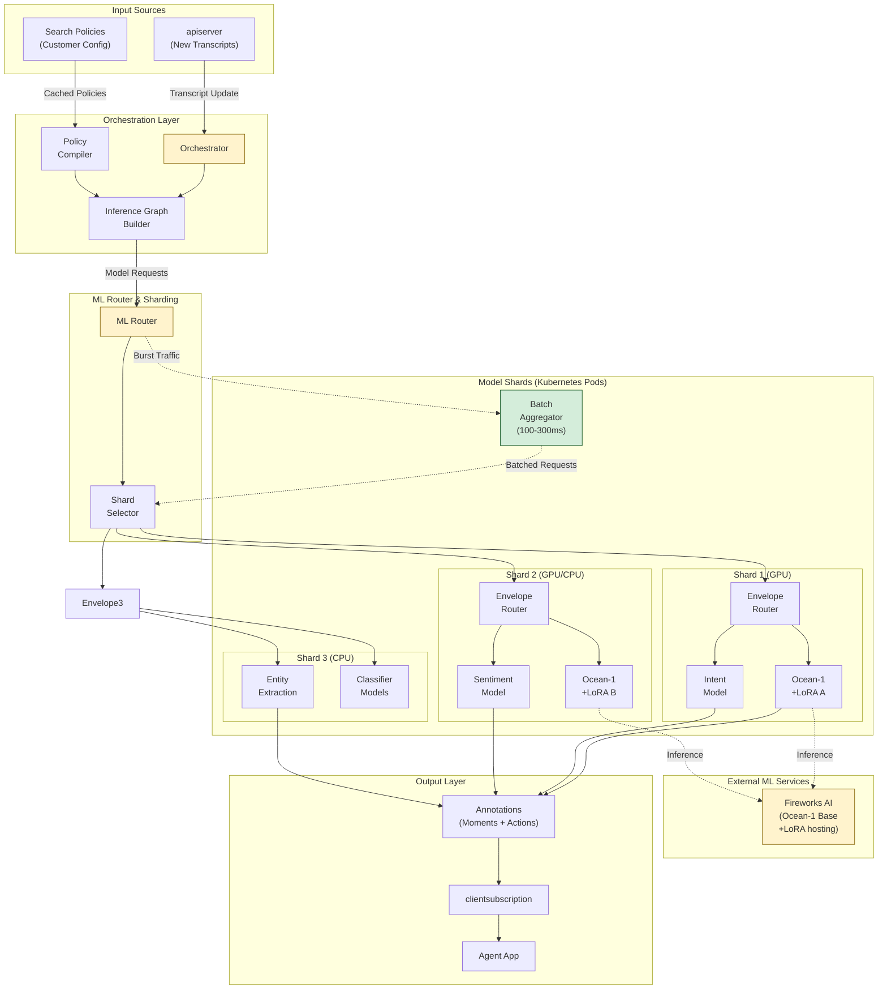

# Cresta ML Services Architecture

## Legend
- 🔒 **Security Risk** - Data protection, authentication, encryption concerns
- ⏱️ **Latency Risk** - Real-time performance critical path
- 📋 **Compliance Risk** - GDPR, PCI-DSS, HIPAA considerations
- ⚙️ **Operational Risk** - Availability, scaling, monitoring concerns
- 🟡 **Yellow/Orange** - Requires follow-up/verification

---

## ML Services Component Architecture



### Diagram Summary
This architecture shows Cresta's ML services layer responsible for generating real-time agent guidance. When **apiserver** receives new transcripts, the **Orchestrator** determines which ML models to invoke by consulting **Search Policies** (customer-specific configurations) to build an **Inference Graph** (execution blueprint). The **ML Router** directs requests to appropriate **Model Shards** - Kubernetes pods containing different model combinations. Each shard has an **Envelope** (internal router) dispatching to Python processes running specific models. Shards are tailored per customer: GPU shards run Ocean-1 foundation model with customer-specific **LoRA adapters** (hosted on Fireworks AI infrastructure), while CPU shards run lighter classifiers. A **Batcher** aggregates burst traffic (100-300ms window) for efficient GPU batch inference. Models generate **Annotations** (moments for detection, actions for guidance) published via clientsubscription to the Agent App. This dynamic architecture ensures each conversation receives exactly the ML processing it needs based on customer policies (team, agent, time interval), all while maintaining low latency through intelligent routing and batching.

---

## Verified Architecture Details

### Orchestrator Service
**Source**: Cresta blog "ML Services, Inference Graphs, and Real-Time Intelligence"

**Verified Responsibilities**:
- **Trigger**: Receives notification from apiserver when transcripts arrive (partial or complete)
- **Decision Engine**: Determines which ML services to invoke and in what sequence
- **Inference Graph**: Builds execution blueprint outlining model calls and dependencies
- **Policy Integration**: Uses compiled search policies to customize ML processing per conversation
- **Output**: Publishes generated annotations (moments + actions) back to agent app

**Key Quote from Source**:
"When a new or updated transcript arrives—whether partial or complete—the orchestrator is responsible for deciding which ML services need to be invoked and in what sequence."

### Search Policies (Customer Configuration)
**Source**: Cresta blog "ML Services, Inference Graphs, and Real-Time Intelligence"

**Verified Functionality**:
- **Purpose**: Specify conditions for which models are used
- **Granularity**: Per agent, team, or time interval
- **Dynamic Nature**: Agents can transition between teams, requiring policy adjustments
- **Compilation**: apiserver compiles applicable policies once per conversation, then caches
- **Benefits**: Accommodates different contact center teams (sales, retention, support) with distinct needs

**Example Use Cases**:
- Sales team gets upsell recommendations, retention team gets save offers
- VIP customer calls trigger additional sentiment analysis
- After-hours calls use simplified model set for cost optimization

### Inference Graph
**Source**: Cresta blog "ML Services, Inference Graphs, and Real-Time Intelligence"

**Verified Concept**:
- **Definition**: Blueprint outlining which ML services called and in what sequence
- **Construction**: Built by orchestrator via search policies
- **Dynamic Branching**: Can feel complex but ensures each conversation gets exactly needed ML processing
- **Dependencies**: Handles model dependencies (e.g., intent detection before knowledge assist)

**Architecture Benefits**:
- Customized processing per customer/team/agent
- Cost optimization by running only necessary models
- Flexibility to add new models without changing core infrastructure

### Model Shards (Kubernetes Pods)
**Source**: Cresta blog "ML Services, Inference Graphs, and Real-Time Intelligence"

**Verified Architecture**:
- **Definition**: Shard = Kubernetes pod containing models
- **Heterogeneity**: Not every pod contains same models
- **Tailoring**: Shards tailored to specific customer needs
- **Efficiency**: Multiple models combined on same GPU(s) for resource optimization
- **CPU Option**: Some shards run entirely on CPUs depending on workload

**Key Quote from Source**:
"These ML Services are grouped into 'shards', with each shard potentially containing different models or supporting different customers. A shard corresponds to a Kubernetes pod. Not every pod will contain the same models; instead, shards are tailored to specific needs, often combining several models onto the same GPU (or multiple GPUs) for efficiency. Some shards may even run entirely on CPUs—it all depends on the workloads and model requirements."

### Envelope (Internal Router)
**Source**: Cresta blog "ML Services, Inference Graphs, and Real-Time Intelligence"

**Verified Purpose**:
- **Location**: Inside each shard/pod
- **Function**: Receives requests from shard entry point, dispatches to correct Python processes
- **Benefit**: Keeps inference latency low in cost-effective manner
- **Speed**: Requests swiftly routed to proper model without detours

**Design Rationale**:
- Reduces overhead by localizing routing within pod
- Avoids network hops for intra-pod model selection
- Enables multiple models to coexist efficiently in same pod

### Batcher Mechanism
**Source**: Cresta blog "ML Services, Inference Graphs, and Real-Time Intelligence"

**Verified Functionality**:
- **Trigger**: Activated when large volumes of requests arrive in bursts
- **Window**: Collects incoming requests over short window (few hundred milliseconds, ~100-300ms)
- **Processing**: Processes all collected requests together
- **Benefit**: Reduces overhead by leveraging GPU batch inference capabilities
- **Real-Time Mode**: For live serving, system remains latency-optimized, forwarding each request immediately

**Trade-off**:
- Batch mode: Higher throughput, slightly higher latency (~100-300ms delay)
- Real-time mode: Lower latency, lower throughput
- System dynamically selects based on traffic patterns

### Ocean-1 Foundation Model + LoRA
**Sources**: Cresta blog posts, Fireworks AI blog, verified partnership details

**Verified Architecture**:
- **Base Model**: Mixtral/Mistral-based Ocean-1 foundation model
- **Customization**: LoRA (Low-Rank Adaptation) adapters per customer
- **Hosting**: Fireworks AI infrastructure
- **Scaling**: Single base model cluster with thousands of LoRA adapters
- **Cost**: 100x reduction vs GPT-4 per inference unit
- **Performance**: Beats GPT-4 in RAG tasks for contact center domain

**LoRA Benefits**:
- GPU memory savings (one adapter per customer on shared base model)
- Continuous improvement from customer feedback data
- No separate model instances needed per customer/use case

**Key Quote from Verified Source (Cresta blog)**:
"We have partnered with Fireworks AI to serve mixtral/mistral-based Ocean models. One single base model cluster is set up for Cresta, while different LoRA adapters on top serve different customers. Fireworks can scale up to thousands of LoRA adapters, so we don't need completely separate models for each customer and use case."

### Model Types in Production
**Source**: Cresta blog posts on Ocean-1 and ML services

**Verified Model Categories**:

1. **Generative Models** (Ocean-1 + LoRA):
   - Knowledge Assist (RAG)
   - Response Generation
   - Chat Suggestions
   - Conversation Summarization

2. **Classification Models**:
   - Intent Detection
   - Sentiment Analysis
   - Behavior Detection (e.g., "Discover Household")
   - Policy Compliance

3. **Extraction Models**:
   - Entity Extraction (PII detection)
   - Named Entity Recognition
   - Key Information Extraction

**Domain Specialization**:
- Contact center-specific training data
- Better out-of-box capabilities than general LLMs
- Instruction-following through RLHF (Reinforcement Learning from Human Feedback)

---

## Component Table

| Component | Type | Verified Capabilities | Latency Impact | Source |
|-----------|------|----------------------|----------------|---------|
| Orchestrator | Business Logic | Policy evaluation, inference graph building, model invocation | Minimal (routing) | ✅ Cresta blog |
| Search Policies | Configuration | Customer/team/agent-specific model selection | N/A (cached) | ✅ Cresta blog |
| ML Router | Traffic Manager | Request routing to appropriate shards | ~5-20ms | ✅ Cresta blog |
| Model Shards | Kubernetes Pods | GPU/CPU model hosting, multiple models per pod | Variable by model | ✅ Cresta blog |
| Envelope | Internal Router | Intra-pod request dispatch to Python processes | <5ms | ✅ Cresta blog |
| Batcher | Optimization | Burst traffic aggregation for batch inference | 100-300ms window | ✅ Cresta blog |
| Ocean-1 + LoRA | Foundation Model | RAG, summarization, generation, hosted on Fireworks | Variable | ✅ Multiple sources |
| Intent Models | Classifiers | Zero-shot and few-shot intent detection | ~50-200ms | ✅ Cresta blog |
| Sentiment Models | Classifiers | Real-time sentiment scoring | ~50-100ms | Estimated |
| Entity Models | Extractors | PII and entity extraction | ~50-150ms | Estimated |

---

## Inference Flow Sequences

### Real-Time ML Processing (During Call)

```
1. apiserver (Transcript Update)
   ↓ (Partial or final transcript event)
2. Orchestrator
   ├─ Load cached search policies for conversation
   ├─ Build inference graph based on policies
   └─ Determine model sequence
3. ML Router
   ├─ Identify target shards for required models
   ├─ Check if batching applicable (burst traffic)
   └─ Route requests to appropriate shards
4. Model Shards (Kubernetes Pods)
   ├─ Envelope receives request
   ├─ Dispatch to appropriate Python model process
   ├─ Model inference (Ocean-1 via Fireworks or local)
   └─ Return annotations (moments/actions)
5. Orchestrator (Aggregation)
   ├─ Collect all model outputs
   ├─ Assemble annotations
   └─ Publish via clientsubscription
6. Agent App
   └─ Display real-time guidance to agent
```

**Latency Considerations**:
- Policy compilation: ~10-50ms (cached after first lookup)
- Inference graph building: ~5-20ms
- Routing: ~5-20ms
- Model inference: 50-500ms (varies by model complexity)
- Aggregation: ~10-30ms
- **Total: ~80-620ms** (excluding model inference variability)

### Batch Processing Mode (High Traffic)

```
1-2. [Same as Real-Time: apiserver → Orchestrator]
3. ML Router
   ├─ Detect burst traffic pattern
   ├─ Activate Batcher
   └─ Batcher collects requests (100-300ms window)
4. Batcher
   ├─ Aggregate requests by model type
   ├─ Send batched request to appropriate shard
   └─ Envelope distributes within batch to model
5. Model Inference (Batch Mode)
   ├─ GPU processes batch simultaneously
   ├─ Higher throughput, efficient GPU utilization
   └─ Return batch results
6-7. [Same as Real-Time: Orchestrator → Agent App]
```

**Trade-off**:
- **Latency**: +100-300ms from batching window
- **Throughput**: ~2-5x improvement in requests/second
- **Cost**: Better GPU utilization, lower cost per inference

---

## Fireworks AI Integration

### Verified Partnership Details
**Sources**: Fireworks AI blog, Cresta blog posts, Sequoia Capital analysis

**Infrastructure Model**:
- **Deployment**: Cresta uses Fireworks AI to host Ocean-1 base model
- **Customization**: Customer-specific LoRA adapters served on single base cluster
- **Scaling**: Supports thousands of LoRA adapters without separate model instances
- **Performance**: Minimal latency, robust uptime critical for enterprise deployments
- **Optimization**: Continuous performance refinements by Fireworks team

**Multi-LoRA Capabilities**:
- **Architecture**: Single Mixtral/Mistral base model + adapter library
- **Efficiency**: Adapters loaded/swapped based on customer request
- **Memory**: LoRA saves GPU memory vs full model fine-tuning
- **Cost**: 100x reduction vs GPT-4 per serving unit

**Quote from Fireworks AI Blog**:
"Cresta utilizes a single mistral-based Ocean model cluster enriched with LoRA adapters, enabling domain-specific variations without provisioning separate models for each customer. Fireworks' infrastructure can support thousands of LoRA adapters, giving Cresta the flexibility to efficiently cater to diverse customer use cases."

### Performance Metrics (Verified)
**Source**: Cresta blog, Fireworks AI customer story

**Ocean-1 Benchmarks**:
- **RAG Performance**: Beats GPT-4 in retrieval-augmented generation tasks
- **Cost**: 100x cost reduction vs GPT-4 per inference unit
- **Latency**: Low latency critical for real-time applications (specific numbers not disclosed)
- **Quality**: Maintained or exceeded GPT-4 quality for contact center domain

**Continuous Improvement**:
- **Feedback Loop**: Thumbs up/down buttons collect training data
- **Iteration**: Customer usage improves models over time
- **Domain Adaptation**: Contact center-specific fine-tuning from private data

---

## Risk Assessment

### ⏱️ Latency Risks

| Component | Target | Estimated | Risk Level | Notes |
|-----------|--------|-----------|------------|-------|
| Policy compilation | <50ms | ~10-50ms | Low | ✅ Cached per conversation |
| Inference graph building | <20ms | ~5-20ms | Low | Lightweight orchestration |
| ML routing | <20ms | ~5-20ms | Low | Efficient shard selection |
| Envelope dispatch | <10ms | <5ms | Low | Intra-pod routing |
| Model inference (classifier) | <200ms | ~50-200ms | Medium | Depends on complexity |
| Model inference (Ocean-1) | Variable | 🟡 Unknown | High | ⚠️ Needs benchmark data |
| Batching window | <300ms | 100-300ms | Medium | Trade-off for throughput |
| Fireworks API latency | <500ms | 🟡 Unknown | High | ⚠️ Needs SLA confirmation |

### 🔒 Security Risks

| Risk | Description | Mitigation | Status |
|------|-------------|------------|--------|
| Model data leakage | Cross-customer data exposure | LoRA isolation per customer | ✅ Architectural isolation |
| API authentication | Unauthorized Fireworks access | 🟡 Verify auth mechanism | Needs clarification |
| Model theft | Unauthorized model access | 🟡 Verify Fireworks security | Needs clarification |
| Inference logs | Sensitive data in request logs | 🟡 Verify log redaction | Needs clarification |

### 📋 Compliance Risks

| Risk | Description | Mitigation | Status |
|------|-------------|------------|--------|
| Data residency | ML inference outside region | 🟡 Verify Fireworks deployment regions | Critical question |
| Model training data | Customer data used for training | LoRA per-customer isolation | ✅ Verified architecture |
| Audit trail | ML decisions not traceable | 🟡 Verify annotation logging | Needs clarification |

### ⚙️ Operational Risks

| Risk | Description | Mitigation | Status |
|------|-------------|------------|--------|
| Fireworks availability | External dependency outage | 🟡 Verify SLA and failover | High priority |
| GPU quota exhaustion | Insufficient shard capacity | Kubernetes autoscaling | ✅ Standard EKS pattern |
| Model versioning | Breaking changes in updates | 🟡 Verify rollout strategy | Needs clarification |
| Cold start latency | New shard startup time | 🟡 Verify warm pool strategy | Needs clarification |

---

## Items Requiring Follow-up 🟡

### Integration-Critical (High Priority)

1. **Fireworks AI SLA and Availability**
   - What is the uptime SLA for Fireworks inference?
   - What happens if Fireworks is unreachable during a call?
   - Is there local fallback or does ML guidance fail?
   - Impact on agent experience during Fireworks outage?

2. **Model Inference Latency Benchmarks**
   - What is p50/p90/p99 latency for Ocean-1 RAG calls?
   - Breakdown by model type (intent, sentiment, entity, Ocean-1)?
   - How does batching affect latency distribution?

3. **Fireworks Deployment Regions**
   - Where are Fireworks AI clusters located geographically?
   - Can customers choose region to ensure data residency?
   - Cross-region latency implications?

### Security & Compliance (High Priority)

4. **Fireworks Authentication & Authorization**
   - How does Cresta authenticate to Fireworks AI?
   - API keys, OAuth, IAM roles?
   - Credential rotation procedures?

5. **Data Handling at Fireworks**
   - Does customer transcript data transit to Fireworks?
   - Is data encrypted in transit and at rest?
   - Data retention policy at Fireworks?
   - DPA/BAA coverage for Fireworks?

6. **Model Isolation Verification**
   - Technical guarantees that LoRA adapters can't access other customer data?
   - Fireworks security certifications (SOC 2, ISO, etc.)?

### Operational Details (Medium Priority)

7. **Model Update Strategy**
   - How are Ocean-1 base model updates deployed?
   - Can customers opt out of updates?
   - Rollback procedures if update causes regressions?

8. **Shard Capacity Planning**
   - How is shard count determined per customer?
   - Auto-scaling triggers and limits?
   - Cold start latency for new shards?

9. **Inference Monitoring**
   - What metrics are exposed for ML inference?
   - CloudWatch dashboards for latency, errors, cost?
   - Alert thresholds for anomaly detection?

10. **Batcher Configuration**
    - Batching window configurable per customer?
    - Automatic switching between real-time and batch mode?
    - Performance characteristics under different traffic patterns?

---

## ML Architecture Strengths (Verified)

1. **Cost Efficiency**: 100x cost reduction vs GPT-4 through LoRA architecture
2. **Customization**: Per-customer LoRA adapters enable domain-specific expertise
3. **Scalability**: Fireworks Multi-LoRA supports thousands of customers on single base model
4. **Flexibility**: Dynamic inference graphs adapt to customer policies
5. **Performance**: Ocean-1 beats GPT-4 in contact center RAG tasks
6. **Continuous Improvement**: Feedback loop enables model iteration from production data

## ML Architecture Considerations

1. **External Dependency**: Critical reliance on Fireworks AI availability (needs SLA confirmation)
2. **Latency Variability**: Ocean-1 inference latency not publicly benchmarked (needs data)
3. **Complexity**: Dynamic inference graphs add operational overhead
4. **Regional Constraints**: Fireworks deployment regions may limit data residency options
5. **Monitoring Gaps**: ML-specific observability requirements need clarification

---

**Document Status**: Updated with comprehensive verified information from Cresta and Fireworks AI sources. Critical gaps flagged for vendor engagement.
