# Cresta ML Services Architecture

## Legend
- 🔒 **Security Risk** - Data protection, authentication, encryption concerns
- ⏱️ **Latency Risk** - Real-time performance critical path
- 📋 **Compliance Risk** - GDPR, PCI-DSS, HIPAA considerations
- ⚙️ **Operational Risk** - Availability, scaling, monitoring concerns
- 🟡 **Yellow/Orange** - Requires follow-up/verification

---

## ML Services High-Level Architecture

```mermaid
flowchart TB
    subgraph Outer[" "]
        subgraph BusinessLogic["Business Logic Layer"]
            direction TB
            APIServer["⚙️ apiserver<br/>Transcript Events"]
            Orchestrator["⚙️ Orchestrator<br/>ML Coordination"]
            PolicyCache["Policy Cache"]
            
            APIServer ==> Orchestrator
            Orchestrator ==> PolicyCache
        end

        subgraph PolicyEngine["Policy Engine"]
            direction TB
            SearchPolicies["📋 Search Policies<br/>Customer Config"]
            InferenceGraph["Inference Graph Builder"]
            PolicyCompiler["Policy Compiler"]
            
            PolicyCache -.->|"Cache Miss"| PolicyCompiler
            PolicyCompiler ==> SearchPolicies ==> InferenceGraph
        end

        subgraph MLRouter["ML Routing Layer"]
            direction TB
            Router["⚙️ ML Router"]
            ShardMap["Shard Map<br/>Customer → Shard"]
            LoadBalancer["Request Load Balancer"]
            
            Router ==> ShardMap
            Router ==> LoadBalancer
        end

        subgraph MLShards["ML Shards (K8s Pods)"]
            direction TB
            subgraph Shard1["Shard 1 - GPU"]
                direction TB
                Envelope1["Envelope<br/>Internal Router"]
                IntentModel1["Intent Detection"]
                SentimentModel1["Sentiment Analysis"]
                EntityModel1["Entity Extraction"]
                
                Envelope1 ==> IntentModel1
                Envelope1 ==> SentimentModel1
                Envelope1 ==> EntityModel1
            end

            subgraph Shard2["Shard 2 - GPU"]
                direction TB
                Envelope2["Envelope"]
                GenAI2["⏱️ Generative AI (Ocean-1)"]
                Summarizer2["Summarization"]
                
                Envelope2 ==> GenAI2
                Envelope2 ==> Summarizer2
            end

            subgraph Shard3["Shard 3 - CPU"]
                direction TB
                Envelope3["Envelope"]
                KeywordModel3["Keyword Detection"]
                RulesEngine3["Rules Engine"]
                
                Envelope3 ==> KeywordModel3
                Envelope3 ==> RulesEngine3
            end
        end

        subgraph ExternalML["External ML Infrastructure"]
            direction TB
            Fireworks["⏱️ Fireworks AI<br/>Ocean-1 Hosting"]
            LoRAAdapters["⏱️ LoRA Adapters<br/>Per-Customer"]
            
            Fireworks ==> LoRAAdapters
        end

        subgraph ModelOutputs["Model Outputs"]
            direction LR
            Moments["Moment Annotations<br/>Intent detected, Keyword found,<br/>Policy violation"]
            Actions["Action Annotations<br/>Hints to display, Suggestions,<br/>Warnings"]
        end

        subgraph ClientDelivery["Client Delivery"]
            direction TB
            ClientSub["clientsubscription"]
            AgentApp["Agent App"]
        end

        %% Flow connections with labels
        Orchestrator ==>|"Inference Request + Graph"| Router
        LoadBalancer ==> Envelope1
        LoadBalancer ==> Envelope2
        LoadBalancer ==> Envelope3
        GenAI2 ==>|"API Call"| Fireworks
        IntentModel1 ==>|"Results"| Moments
        SentimentModel1 ==>|"Results"| Moments
        GenAI2 ==>|"Results"| Actions
        KeywordModel3 ==>|"Results"| Moments
        Moments ==>|"Aggregated"| Orchestrator
        Actions ==>|"Aggregated"| Orchestrator
        Orchestrator ==>|"Publish Events"| ClientSub
        ClientSub ==>|"WebSocket Push"| AgentApp
    end
    
    %% Outer container with white background
    style Outer fill:#ffffff,stroke:#d1d5db,stroke-width:2px
    
    %% Transparent group backgrounds with light gray borders
    style BusinessLogic fill:none,stroke:#9ca3af,stroke-width:1.5px
    style PolicyEngine fill:none,stroke:#9ca3af,stroke-width:1.5px
    style MLRouter fill:none,stroke:#9ca3af,stroke-width:1.5px
    style MLShards fill:none,stroke:#9ca3af,stroke-width:1.5px
    style ExternalML fill:none,stroke:#9ca3af,stroke-width:1.5px
    style ModelOutputs fill:none,stroke:#9ca3af,stroke-width:1.5px
    style ClientDelivery fill:none,stroke:#9ca3af,stroke-width:1.5px
    style Shard1 fill:none,stroke:#9ca3af,stroke-width:1px
    style Shard2 fill:none,stroke:#9ca3af,stroke-width:1px
    style Shard3 fill:none,stroke:#9ca3af,stroke-width:1px
    
    %% Node styling - very light gray backgrounds
    style APIServer fill:#fcfcfd,stroke:#1f2937,stroke-width:2px
    style Orchestrator fill:#fcfcfd,stroke:#d97706,stroke-width:2.5px
    style PolicyCache fill:#fcfcfd,stroke:#1f2937,stroke-width:2px
    style SearchPolicies fill:#fcfcfd,stroke:#1f2937,stroke-width:2px
    style InferenceGraph fill:#fcfcfd,stroke:#1f2937,stroke-width:2px
    style PolicyCompiler fill:#fcfcfd,stroke:#1f2937,stroke-width:2px
    style Router fill:#fcfcfd,stroke:#d97706,stroke-width:2.5px
    style ShardMap fill:#fcfcfd,stroke:#1f2937,stroke-width:2px
    style LoadBalancer fill:#fcfcfd,stroke:#1f2937,stroke-width:2px
    style Envelope1 fill:#fcfcfd,stroke:#1f2937,stroke-width:2px
    style IntentModel1 fill:#fcfcfd,stroke:#1f2937,stroke-width:2px
    style SentimentModel1 fill:#fcfcfd,stroke:#1f2937,stroke-width:2px
    style EntityModel1 fill:#fcfcfd,stroke:#1f2937,stroke-width:2px
    style Envelope2 fill:#fcfcfd,stroke:#1f2937,stroke-width:2px
    style GenAI2 fill:#fcfcfd,stroke:#d97706,stroke-width:2.5px
    style Summarizer2 fill:#fcfcfd,stroke:#1f2937,stroke-width:2px
    style Envelope3 fill:#fcfcfd,stroke:#1f2937,stroke-width:2px
    style KeywordModel3 fill:#fcfcfd,stroke:#1f2937,stroke-width:2px
    style RulesEngine3 fill:#fcfcfd,stroke:#1f2937,stroke-width:2px
    style Fireworks fill:#fcfcfd,stroke:#d97706,stroke-width:2.5px
    style LoRAAdapters fill:#fcfcfd,stroke:#1f2937,stroke-width:2px
    style Moments fill:#fcfcfd,stroke:#1f2937,stroke-width:2px
    style Actions fill:#fcfcfd,stroke:#1f2937,stroke-width:2px
    style ClientSub fill:#fcfcfd,stroke:#1f2937,stroke-width:2px
    style AgentApp fill:#fcfcfd,stroke:#1f2937,stroke-width:2px
```

---

## Inference Graph Execution

```mermaid
flowchart LR
    subgraph Outer[" "]
        subgraph Input["Input"]
            Transcript["Transcript<br/>+ Previous<br/>Annotations"]
        end

        subgraph GraphStages["Inference Graph Stages"]
            Stage1["Stage 1<br/>Parallel"]
            Stage2["Stage 2<br/>Sequential"]
            Stage3["Stage 3<br/>Conditional"]
        end

        subgraph Stage1Models["Stage 1: Fast Models"]
            Keyword["Keyword<br/>Detection<br/>CPU"]
            Intent["Intent<br/>Classification<br/>GPU"]
            Sentiment["Sentiment<br/>GPU"]
        end

        subgraph Stage2Models["Stage 2: Dependent Models"]
            Entity["Entity<br/>Extraction"]
            TopicClass["Topic<br/>Classification"]
        end

        subgraph Stage3Models["Stage 3: Generative"]
            Knowledge["⏱️ Knowledge<br/>Assist (RAG)"]
            Suggestion["⏱️ Response<br/>Suggestion"]
        end

        subgraph Output["Output"]
            Combined["Combined<br/>Annotations"]
        end

        Transcript ==>|"Input"| Stage1
        Stage1 ==>|"Route"| Keyword
        Stage1 ==>|"Route"| Intent
        Stage1 ==>|"Route"| Sentiment

        Keyword ==>|"Results"| Stage2
        Intent ==>|"Results"| Stage2
        Sentiment ==>|"Results"| Stage2

        Stage2 ==>|"Route"| Entity
        Stage2 ==>|"Route"| TopicClass

        Entity ==>|"Trigger"| Stage3
        TopicClass ==>|"Trigger"| Stage3

        Stage3 -.->|"If conditions met"| Knowledge
        Stage3 -.->|"If conditions met"| Suggestion

        Knowledge ==>|"Output"| Combined
        Suggestion ==>|"Output"| Combined
        Entity ==>|"Output"| Combined
        Intent ==>|"Output"| Combined
    end
    
    %% Outer container with white background
    style Outer fill:#ffffff,stroke:#d1d5db,stroke-width:2px
    
    %% Transparent group backgrounds with light gray borders
    style Input fill:none,stroke:#9ca3af,stroke-width:1.5px
    style GraphStages fill:none,stroke:#9ca3af,stroke-width:1.5px
    style Stage1Models fill:none,stroke:#9ca3af,stroke-width:1.5px
    style Stage2Models fill:none,stroke:#9ca3af,stroke-width:1.5px
    style Stage3Models fill:none,stroke:#9ca3af,stroke-width:1.5px
    style Output fill:none,stroke:#9ca3af,stroke-width:1.5px
    
    %% Node styling - very light gray backgrounds
    style Transcript fill:#fcfcfd,stroke:#1f2937,stroke-width:2px
    style Stage1 fill:#fcfcfd,stroke:#1f2937,stroke-width:2px
    style Stage2 fill:#fcfcfd,stroke:#1f2937,stroke-width:2px
    style Stage3 fill:#fcfcfd,stroke:#1f2937,stroke-width:2px
    style Keyword fill:#fcfcfd,stroke:#059669,stroke-width:2.5px
    style Intent fill:#fcfcfd,stroke:#1f2937,stroke-width:2px
    style Sentiment fill:#fcfcfd,stroke:#1f2937,stroke-width:2px
    style Entity fill:#fcfcfd,stroke:#1f2937,stroke-width:2px
    style TopicClass fill:#fcfcfd,stroke:#1f2937,stroke-width:2px
    style Knowledge fill:#fcfcfd,stroke:#d97706,stroke-width:2.5px
    style Suggestion fill:#fcfcfd,stroke:#d97706,stroke-width:2.5px
    style Combined fill:#fcfcfd,stroke:#1f2937,stroke-width:2px
```

---

## Policy-Based Model Selection

---

## Ocean-1 Foundation Model Architecture

```mermaid
flowchart TB
    subgraph Outer[" "]
        subgraph BaseModel["Base Foundation Model"]
            Mistral["Mistral 7B<br/>Base LLM"]
        end

        subgraph DomainTraining["Domain Fine-Tuning"]
            ContactCenterData["Contact Center<br/>Training Data"]
            InstructionTuning["Instruction<br/>Fine-Tuning"]
            RLHF["Reinforcement Learning<br/>Human Feedback"]
        end

        subgraph Ocean1["Ocean-1 Model"]
            OceanBase["⏱️ Ocean-1 Base<br/>Domain-Specialized"]
        end

        subgraph CustomerAdaptation["Customer-Specific Adaptation"]
            CustomerData["Customer<br/>Proprietary Data"]
            LoRATraining["LoRA Adapter<br/>Training"]
            LoRAAdapter["Customer LoRA<br/>Adapter"]
        end

        subgraph Serving["Fireworks AI Serving"]
            BaseCluster["Single Base<br/>Model Cluster"]
            MultiLoRA["⏱️ Multi-LoRA<br/>Serving<br/>1000s of adapters"]
        end

        subgraph UseCases["Use Cases Served"]
            KnowledgeAssist["Knowledge Assist<br/>RAG"]
            Summarization["Call Summarization"]
            ChatSuggestions["Chat Suggestions"]
            ResponseGen["Response Generation"]
        end

        Mistral ==>|"Train"| ContactCenterData
        ContactCenterData ==>|"Fine-tune"| InstructionTuning
        InstructionTuning ==>|"RLHF"| RLHF
        RLHF ==>|"Produces"| OceanBase

        OceanBase ==>|"Adapt"| CustomerData
        CustomerData ==>|"Train"| LoRATraining
        LoRATraining ==>|"Produces"| LoRAAdapter

        OceanBase ==>|"Deploy"| BaseCluster
        LoRAAdapter ==>|"Load"| MultiLoRA
        BaseCluster ==>|"Combine"| MultiLoRA

        MultiLoRA ==>|"Serve"| KnowledgeAssist
        MultiLoRA ==>|"Serve"| Summarization
        MultiLoRA ==>|"Serve"| ChatSuggestions
        MultiLoRA ==>|"Serve"| ResponseGen
    end
    
    %% Outer container with white background
    style Outer fill:#ffffff,stroke:#d1d5db,stroke-width:2px
    
    %% Transparent group backgrounds with light gray borders
    style BaseModel fill:none,stroke:#9ca3af,stroke-width:1.5px
    style DomainTraining fill:none,stroke:#9ca3af,stroke-width:1.5px
    style Ocean1 fill:none,stroke:#9ca3af,stroke-width:1.5px
    style CustomerAdaptation fill:none,stroke:#9ca3af,stroke-width:1.5px
    style Serving fill:none,stroke:#9ca3af,stroke-width:1.5px
    style UseCases fill:none,stroke:#9ca3af,stroke-width:1.5px
    
    %% Node styling - very light gray backgrounds
    style Mistral fill:#fcfcfd,stroke:#1f2937,stroke-width:2px
    style ContactCenterData fill:#fcfcfd,stroke:#1f2937,stroke-width:2px
    style InstructionTuning fill:#fcfcfd,stroke:#1f2937,stroke-width:2px
    style RLHF fill:#fcfcfd,stroke:#1f2937,stroke-width:2px
    style OceanBase fill:#fcfcfd,stroke:#059669,stroke-width:2.5px
    style CustomerData fill:#fcfcfd,stroke:#1f2937,stroke-width:2px
    style LoRATraining fill:#fcfcfd,stroke:#1f2937,stroke-width:2px
    style LoRAAdapter fill:#fcfcfd,stroke:#059669,stroke-width:2.5px
    style BaseCluster fill:#fcfcfd,stroke:#1f2937,stroke-width:2px
    style MultiLoRA fill:#fcfcfd,stroke:#d97706,stroke-width:2.5px
    style KnowledgeAssist fill:#fcfcfd,stroke:#1f2937,stroke-width:2px
    style Summarization fill:#fcfcfd,stroke:#1f2937,stroke-width:2px
    style ChatSuggestions fill:#fcfcfd,stroke:#1f2937,stroke-width:2px
    style ResponseGen fill:#fcfcfd,stroke:#1f2937,stroke-width:2px
```

---

## Batching and Request Handling

---

## Model Performance Benchmarks

### Ocean-1 vs GPT-4 (from Cresta Docs)

| Metric | Ocean-1 (7B) | GPT-4 | Notes |
|--------|--------------|-------|-------|
| RAG Accuracy | Higher | Baseline | Domain fine-tuning advantage |
| Cost | 100x cheaper | $0.03/1k tokens | LoRA efficiency |
| Latency | Lower | Higher | Smaller model size |
| Hallucination Rate | Lower | Baseline | Contact center specialization |

### Use Case Performance

| Use Case | Model | Latency Target | Accuracy |
|----------|-------|----------------|----------|
| Intent Detection | Custom SLM | <100ms | 🟡 TBD |
| Keyword Detection | Rules + ML | <50ms | High |
| Knowledge Assist | Ocean-1 + RAG | <500ms | Beat GPT-4 |
| Summarization | Ocean-1 | End of call | High |
| Sentiment | Custom | <100ms | 🟡 TBD |

---

## Risk Assessment

### ⏱️ Latency Risks

| Component | Risk | Impact | Mitigation |
|-----------|------|--------|------------|
| Fireworks API | External dependency | Guidance delay | Regional endpoints, caching |
| GPU Contention | Model queue buildup | Slow inference | Auto-scaling, batching |
| Inference Graph | Complex chains | Cumulative delay | Parallel execution |

### ⚙️ Operational Risks

| Component | Risk | Impact | Mitigation |
|-----------|------|--------|------------|
| LoRA Adapters | 1000s of adapters | Memory pressure | Multi-LoRA serving |
| Model Updates | Customer-specific | Regression risk | A/B testing, rollback |
| Shard Failure | Pod crash | Lost capacity | K8s auto-restart, redundancy |

### 🔒 Security Risks

| Component | Risk | Impact | Mitigation |
|-----------|------|--------|------------|
| Customer Data in Training | Data leakage | Privacy violation | Isolated LoRA per customer |
| Model Prompts | Injection attacks | Unexpected behavior | Input sanitization |

---

## Items Requiring Follow-up 🟡

1. **Model Inventory** - Complete list of models and their purposes
2. **Latency SLAs** - Specific latency guarantees per model type
3. **Scaling Behavior** - Auto-scaling rules for ML shards
4. **Model Versioning** - How are model updates rolled out?
5. **Fallback Models** - What happens if a custom model fails?
6. **Accuracy Metrics** - Current production accuracy for each model type

---

## Summary

This document describes the ML inference architecture that processes transcripts to generate real-time guidance, knowledge assist, and conversation intelligence for agents.

**Key ML Architecture Components**:
1. **Policy Engine**: Customer-specific policies (agent/team/org level) determine which models run and when
2. **Inference Graph**: Multi-stage execution (parallel fast models → sequential dependent models → conditional generative models)
3. **ML Router**: Routes requests to appropriate shards based on customer mapping and load balancing
4. **Model Shards**: Kubernetes pods (GPU/CPU) hosting specialized models (intent, sentiment, entity extraction, generative AI)
5. **Ocean-1 Foundation Model**: Mistral 7B base model fine-tuned for contact centers, hosted on Fireworks AI with LoRA adapters per customer

**Ocean-1 Model Details** (Confirmed via web search):
- **Base Model**: Mistral 7B
- **Fine-tuning**: Contact center domain data + instruction tuning + RLHF
- **Customer Adaptation**: LoRA adapters trained on customer-specific data
- **Hosting**: Fireworks AI with multi-LoRA serving (1000s of adapters)
- **Use Cases**: Knowledge Assist (RAG), summarization, chat suggestions, response generation

**Performance Characteristics**:
- **Batching**: 100-200ms collection window for throughput optimization
- **Real-time Mode**: Direct forwarding bypassing batcher for low-latency requests
- **Target Latencies**: <500ms for Knowledge Assist, <200ms for agent assist suggestions (per Cresta-review.md)

**Verification Status**: Ocean-1 model architecture (Mistral 7B base, Fireworks hosting, LoRA adapters) confirmed via Cresta blog and web search. Model inventory, exact latency SLAs, scaling rules, and accuracy metrics require Cresta confirmation.
