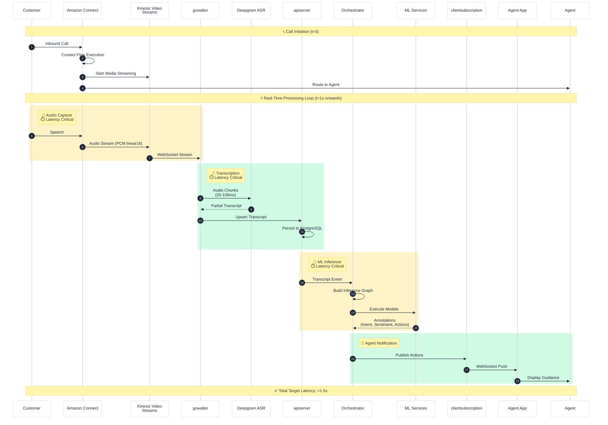
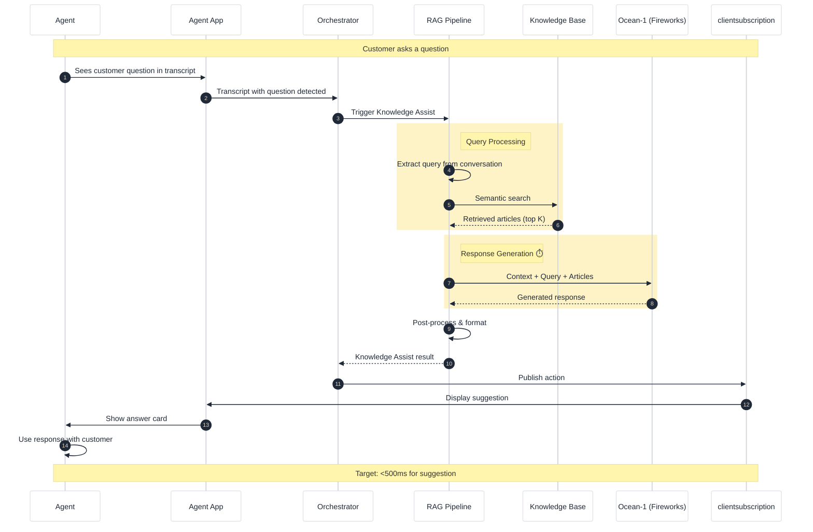
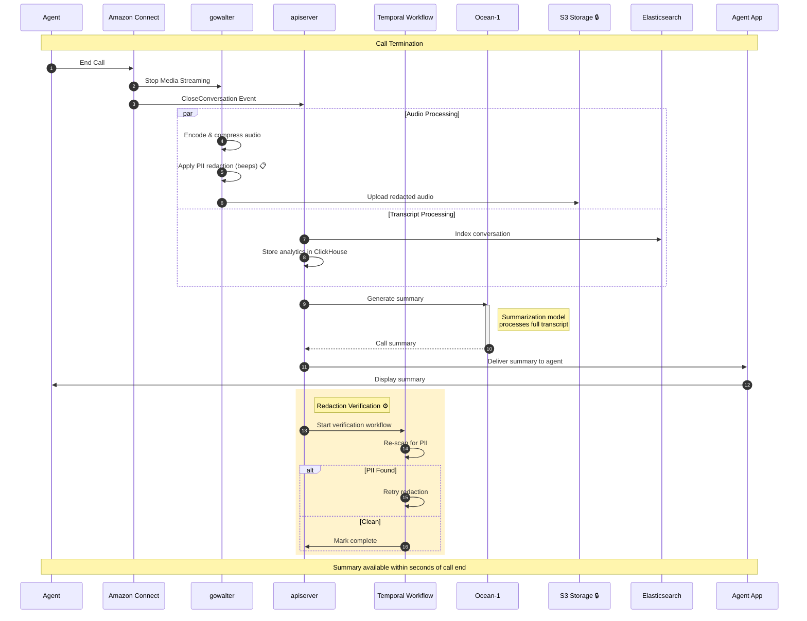
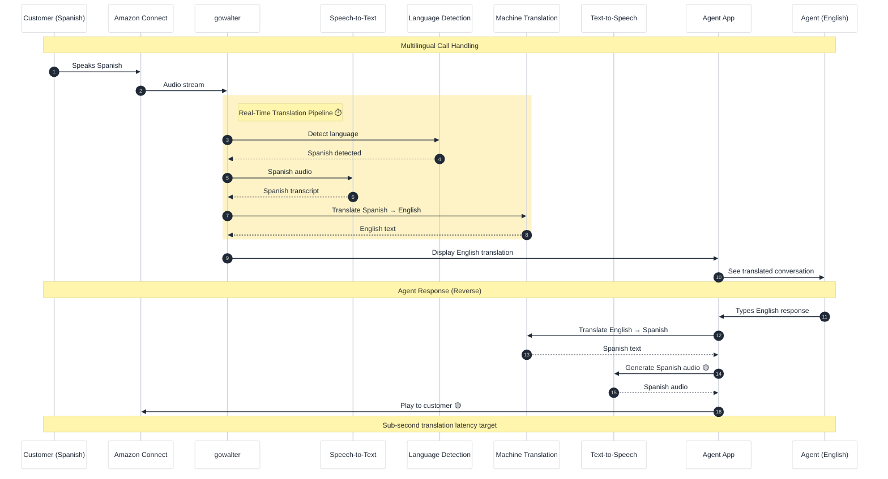
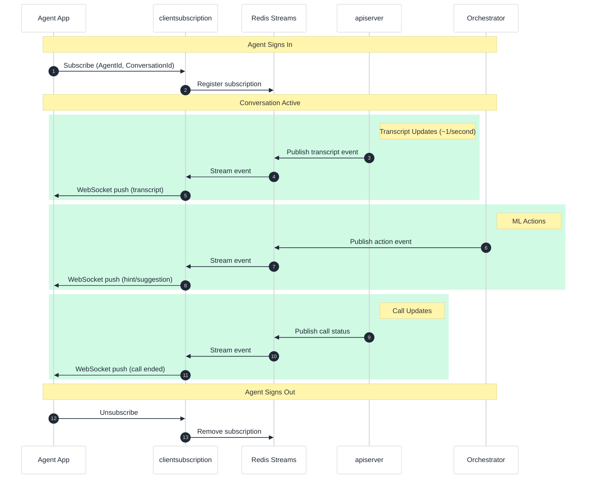
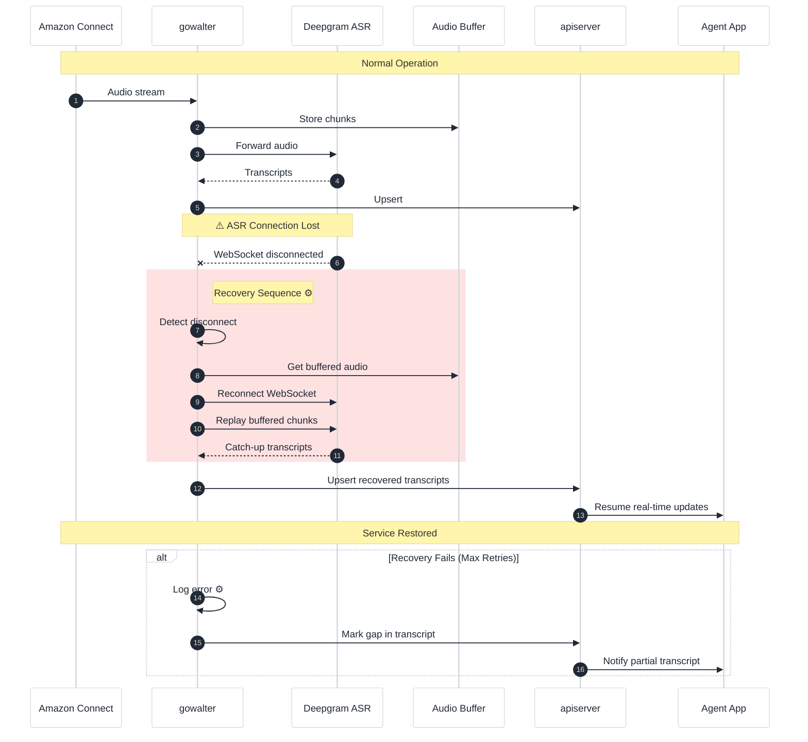

# Real-Time Data Flow - Sequence Diagrams

## Legend
- 🔒 **Security Risk** - Data protection, authentication, encryption concerns
- ⏱️ **Latency Risk** - Real-time performance critical path
- 📋 **Compliance Risk** - GDPR, PCI-DSS, HIPAA considerations
- ⚙️ **Operational Risk** - Availability, scaling, monitoring concerns
- 🟡 **Yellow/Orange** - Requires follow-up/verification

---

## End-to-End Real-Time Guidance Flow

---

## Knowledge Assist Flow (RAG)

---

## Call Summarization Flow (End of Call)

---

## Real-Time Translation Flow

---

## Agent App Event Subscription Flow

---

## Error Recovery Flow

---

## Latency Budget Breakdown

### Target: Speech → Agent Guidance < 1.5 seconds

```mermaid
flowchart LR
    subgraph Outer[" "]
        subgraph Audio["Audio Processing (0-150ms)"]
            direction LR
            A1[Audio Chunk<br/>Capture<br/>0-100ms]
            A2[Network to<br/>Cresta<br/>100-150ms]
            A1 ==> A2
        end
        
        subgraph ASR["ASR Processing (150-500ms)"]
            direction LR
            A3[ASR<br/>Processing<br/>150-450ms]
            A4[Transcript<br/>Delivery<br/>450-500ms]
            A3 ==> A4
        end
        
        subgraph ML["ML Inference (500-1100ms)"]
            direction LR
            A5[Orchestrator<br/>Routing<br/>500-550ms]
            A6[Model<br/>Inference<br/>550-1050ms]
            A7[Result<br/>Aggregation<br/>1050-1100ms]
            A5 ==> A6 ==> A7
        end
        
        subgraph Delivery["Delivery (1100-1250ms)"]
            direction LR
            A8[Event<br/>Publish<br/>1100-1150ms]
            A9[WebSocket<br/>to App<br/>1150-1200ms]
            A10[UI<br/>Render<br/>1200-1250ms]
            A8 ==> A9 ==> A10
        end
        
        A2 ==>|"Audio Stream"| A3
        A4 ==>|"Transcript"| A5
        A7 ==>|"Annotations"| A8
    end
    
    %% Outer container with white background
    style Outer fill:#ffffff,stroke:#d1d5db,stroke-width:2px
    
    %% Transparent group backgrounds with light gray borders
    style Audio fill:none,stroke:#9ca3af,stroke-width:1.5px
    style ASR fill:none,stroke:#9ca3af,stroke-width:1.5px
    style ML fill:none,stroke:#9ca3af,stroke-width:1.5px
    style Delivery fill:none,stroke:#9ca3af,stroke-width:1.5px
    
    %% Node styling - very light gray backgrounds
    style A1 fill:#fcfcfd,stroke:#d97706,stroke-width:2.5px
    style A2 fill:#fcfcfd,stroke:#1f2937,stroke-width:2px
    style A3 fill:#fcfcfd,stroke:#d97706,stroke-width:2.5px
    style A4 fill:#fcfcfd,stroke:#1f2937,stroke-width:2px
    style A5 fill:#fcfcfd,stroke:#1f2937,stroke-width:2px
    style A6 fill:#fcfcfd,stroke:#d97706,stroke-width:2.5px
    style A7 fill:#fcfcfd,stroke:#1f2937,stroke-width:2px
    style A8 fill:#fcfcfd,stroke:#1f2937,stroke-width:2px
    style A9 fill:#fcfcfd,stroke:#1f2937,stroke-width:2px
    style A10 fill:#fcfcfd,stroke:#1f2937,stroke-width:2px
```

| Stage | Target (ms) | Risk Level | Notes |
|-------|-------------|------------|-------|
| Audio Capture | 100 | Low | Chunk size dependent |
| Network (KVS → Cresta) | 50 | Medium | Regional proximity matters |
| ASR Processing | 300 | **High** ⏱️ | Critical path |
| Transcript Delivery | 50 | Low | Internal network |
| Orchestrator | 50 | Low | Cached policies |
| ML Inference | 500 | **High** ⏱️ | Model dependent |
| Event Publishing | 50 | Low | Redis streams |
| WebSocket Delivery | 50 | Medium | Client network |
| UI Render | 50 | Low | Client performance |
| **Total** | **1250** | - | 250ms buffer |

---

## Items Requiring Follow-up 🟡

1. **TTS for Translation** - How is translated audio played back to customer?
2. **WebSocket Protocol** - Exact protocol between components (ws/wss, message format)
3. **Retry Policies** - Specific retry counts and backoff strategies
4. **Circuit Breakers** - Are there circuit breakers for external services?
5. **Metric Collection** - How are latency metrics captured and monitored?
6. **SLA Definitions** - Published SLAs for real-time guidance latency

---

## Summary

This document provides sequence diagrams for key real-time data flows in the Cresta platform, focusing on latency-critical paths and end-to-end guidance delivery.

**Key Flows Documented**:
1. **End-to-End Real-Time Guidance**: Customer speech → KVS → gowalter → ASR → apiserver → Orchestrator → ML Services → clientsubscription → Agent App (target <1.5s)
2. **Knowledge Assist (RAG)**: Question detection → RAG pipeline → Knowledge Base search → Ocean-1 generation → Agent App (target <500ms)
3. **Call Summarization**: Call end → Audio encoding/redaction → Ocean-1 summarization → Agent App (within seconds of disconnect)
4. **Real-Time Translation**: Multi-language call handling with STT, translation, and TTS (TTS playback method requires verification)
5. **Agent App Event Subscription**: WebSocket-based real-time updates (transcripts, ML actions, call status)
6. **Error Recovery**: ASR disconnection → gowalter buffer replay → transcript continuity

**Latency Budget Breakdown** (Target: <1.5s total):
- Audio Processing: 0-150ms (capture + network to Cresta)
- ASR Processing: 150-500ms (ASR processing + transcript delivery)
- ML Inference: 500-1100ms (orchestrator routing + model inference + result aggregation)
- Delivery: 1100-1250ms (event publish + WebSocket to App + UI render)

**Verification Status**: Flow sequences are logically structured and consistent with real-time requirements. Latency targets are documented but should be verified against Cresta published SLAs. Translation flow includes TTS and audio playback components that require Cresta confirmation.
