# Data Storage Architecture

## Legend
- 🔒 **Security Risk** - Data protection, authentication, encryption concerns
- ⏱️ **Latency Risk** - Real-time performance critical path
- 📋 **Compliance Risk** - GDPR, PCI-DSS, HIPAA considerations
- ⚙️ **Operational Risk** - Availability, scaling, monitoring concerns
- 🟡 **Yellow/Orange** - Requires follow-up/verification

---

## Data Architecture Overview

```mermaid
flowchart TB
    subgraph Outer[" "]
        subgraph DataSources["Data Sources"]
            direction LR
            Audio["Audio Streams"]
            Transcripts["Transcripts"]
            Annotations["ML Annotations"]
            AgentActions["Agent Actions"]
            Config["Configuration"]
        end

        subgraph DataLayer["Data Storage Layer"]
            direction TB
            subgraph Operational["Operational Stores"]
                direction LR
                Postgres[(📋 🔒 PostgreSQL<br/>Conversations, Transcripts,<br/>Users, Policies)]
                Redis[(Redis<br/>Event Streams,<br/>Session Cache, Policy Cache)]
            end

            subgraph Analytics["Analytics Stores"]
                direction LR
                ES[(Elasticsearch<br/>Conversation Search,<br/>Full-text Index)]
                ClickHouse[(ClickHouse<br/>Analytics, Metrics,<br/>Aggregations)]
            end

            subgraph ObjectStorage["Object Storage"]
                direction LR
                S3Audio[(🔒 📋 S3<br/>Audio Files<br/>Encrypted)]
                S3Models[(S3<br/>Model Artifacts)]
            end
        end

        subgraph DataIsolation["Customer Data Isolation"]
            direction LR
            TenantDB["🔒 Separate Databases<br/>per Customer"]
            TenantBucket["🔒 Separate S3 Paths<br/>per Customer"]
            TenantIndex["🔒 Separate ES Indices<br/>per Customer"]
        end

        Audio ==>|"Store"| S3Audio
        Transcripts ==>|"Persist"| Postgres
        Transcripts ==>|"Index"| ES
        Annotations ==>|"Store"| Postgres
        Annotations ==>|"Analytics"| ClickHouse
        AgentActions ==>|"Analytics"| ClickHouse
        Config ==>|"Store"| Postgres
        Config ==>|"Cache"| Redis

        Postgres ==>|"Isolated by"| TenantDB
        S3Audio ==>|"Isolated by"| TenantBucket
        ES ==>|"Isolated by"| TenantIndex
    end
    
    %% Outer container with white background
    style Outer fill:#ffffff,stroke:#d1d5db,stroke-width:2px
    
    %% Transparent group backgrounds with light gray borders
    style DataSources fill:none,stroke:#9ca3af,stroke-width:1.5px
    style DataLayer fill:none,stroke:#9ca3af,stroke-width:1.5px
    style DataIsolation fill:none,stroke:#9ca3af,stroke-width:1.5px
    style Operational fill:none,stroke:#9ca3af,stroke-width:1px
    style Analytics fill:none,stroke:#9ca3af,stroke-width:1px
    style ObjectStorage fill:none,stroke:#9ca3af,stroke-width:1px
    
    %% Node styling - very light gray backgrounds
    style Audio fill:#fcfcfd,stroke:#1f2937,stroke-width:2px
    style Transcripts fill:#fcfcfd,stroke:#1f2937,stroke-width:2px
    style Annotations fill:#fcfcfd,stroke:#1f2937,stroke-width:2px
    style AgentActions fill:#fcfcfd,stroke:#1f2937,stroke-width:2px
    style Config fill:#fcfcfd,stroke:#1f2937,stroke-width:2px
    style Postgres fill:#fcfcfd,stroke:#059669,stroke-width:2.5px
    style Redis fill:#fcfcfd,stroke:#1f2937,stroke-width:2px
    style ES fill:#fcfcfd,stroke:#1f2937,stroke-width:2px
    style ClickHouse fill:#fcfcfd,stroke:#1f2937,stroke-width:2px
    style S3Audio fill:#fcfcfd,stroke:#059669,stroke-width:2.5px
    style S3Models fill:#fcfcfd,stroke:#1f2937,stroke-width:2px
    style TenantDB fill:#fcfcfd,stroke:#dc2626,stroke-width:2px
    style TenantBucket fill:#fcfcfd,stroke:#dc2626,stroke-width:2px
    style TenantIndex fill:#fcfcfd,stroke:#dc2626,stroke-width:2px
```

---

## Regional Data Residency

---

## Data Retention & Lifecycle

---

## Data Storage Components

### Operational Stores

| Component | Purpose | Data Types | Isolation |
|-----------|---------|------------|-----------|
| **PostgreSQL** | Primary transactional database | Conversations, transcripts, users, policies, annotations | Separate database per customer |
| **Redis** | Real-time event streaming and caching | Event streams, session cache, policy cache | Logical separation via keyspace |

### Analytics Stores

| Component | Purpose | Data Types | Isolation |
|-----------|---------|------------|-----------|
| **Elasticsearch** | Full-text search and conversation indexing | Conversation search, full-text index | Separate index per customer |
| **ClickHouse** | Analytics and metrics aggregation | Analytics, metrics, aggregations | Logical separation via schema/table |

### Object Storage

| Component | Purpose | Data Types | Isolation |
|-----------|---------|------------|-----------|
| **S3 (Audio)** | Encrypted audio file storage | Redacted audio files | Separate S3 path/bucket per customer |
| **S3 (Models)** | Model artifacts and training data | Model artifacts, training datasets | Logical separation via path structure |

---

## Customer Data Isolation

**Isolation Strategy**: Multi-tenant architecture with logical and physical separation per customer.

| Isolation Level | Implementation | Purpose |
|----------------|----------------|---------|
| **Database** | Separate PostgreSQL database per customer | Complete data isolation at storage layer |
| **S3 Storage** | Separate S3 paths/buckets per customer | Audio and model artifact isolation |
| **Search Index** | Separate Elasticsearch indices per customer | Search data isolation |
| **Kubernetes** | Logical separation via namespaces | Runtime isolation |

---

## Data Retention & Lifecycle

### Retention Periods

| Data Type | Default Retention | Customer Configurable | Notes |
|-----------|-------------------|----------------------|-------|
| **Audio Files** | 90 days | Yes | 🟡 Default requires verification |
| **Transcripts** | 1 year | Yes | 🟡 Default requires verification |
| **Annotations** | Customer-defined | Yes | ML annotations, moments, insights |
| **Analytics** | Indefinite | Yes | Aggregated metrics for historical analysis |

### Lifecycle Management

1. **Active Storage**: Data in primary storage (PostgreSQL, S3 Standard)
2. **Archive**: Data moved to archive storage (S3 Glacier assumed, requires verification)
3. **Secure Deletion**: Data permanently deleted after archive retention period

---

## Risk Summary

### ⚙️ Operational Risks

| Risk | Severity | Status | Mitigation |
|------|----------|--------|------------|
| Data loss | High | Mitigated | S3 durability, backups |
| Slow search | Medium | Mitigated | Elasticsearch indexing |
| Storage costs | Low | Monitor | Lifecycle policies |

---

## Items Requiring Follow-up 🟡

1. **Data Retention Defaults** - What are the default retention periods for each data type?
2. **APAC Region** - Is AP-Southeast-1 available for data residency?
3. **Archive Strategy** - Is S3 Glacier used for long-term audio storage?
4. **Deletion Process** - What is the process for customer data deletion requests?
5. **Backup RPO/RTO** - What are the backup and recovery objectives?

---

## Summary

This document describes the data storage architecture, customer data isolation, regional data residency, and data lifecycle management for the Cresta platform.

**Data Storage Architecture**:
- **Operational Stores**: PostgreSQL (conversations, transcripts, users, policies), Redis (event streams, session cache, policy cache)
- **Analytics Stores**: Elasticsearch (conversation search, full-text index), ClickHouse (analytics, metrics, aggregations)
- **Object Storage**: AWS S3 (encrypted audio files, model artifacts)
- **Customer Isolation**: Separate databases, S3 paths, and ES indices per customer

**Regional Data Residency**:
- **US**: us-west-2 region confirmed
- **EU**: eu-west-1 region confirmed
- **APAC**: ap-southeast-1 requires verification

**Data Retention & Lifecycle**:
- **Retention**: Customer-configurable (defaults require verification)
- **Lifecycle**: Active storage → Archive (S3 Glacier assumed, requires verification) → Secure deletion

**Verification Status**: Data isolation approach consistent with Cresta blog. Data retention defaults, APAC region availability, archive strategy, and backup RPO/RTO require Cresta confirmation.
