# Data Storage & Security Architecture

## Legend
- 🔒 **Security Risk** - Data protection, authentication, encryption concerns
- ⏱️ **Latency Risk** - Real-time performance critical path
- 📋 **Compliance Risk** - GDPR, PCI-DSS, HIPAA considerations
- ⚙️ **Operational Risk** - Availability, scaling, monitoring concerns
- 🟡 **Yellow/Orange** - Requires follow-up/verification

---

## Data Architecture Overview

```mermaid
flowchart TB
    subgraph Outer[" "]
        subgraph DataSources["Data Sources"]
            direction LR
            Audio["Audio Streams"]
            Transcripts["Transcripts"]
            Annotations["ML Annotations"]
            AgentActions["Agent Actions"]
            Config["Configuration"]
        end

        subgraph DataLayer["Data Storage Layer"]
            direction TB
            subgraph Operational["Operational Stores"]
                direction LR
                Postgres[(📋 🔒 PostgreSQL<br/>Conversations, Transcripts,<br/>Users, Policies)]
                Redis[(Redis<br/>Event Streams,<br/>Session Cache, Policy Cache)]
            end

            subgraph Analytics["Analytics Stores"]
                direction LR
                ES[(Elasticsearch<br/>Conversation Search,<br/>Full-text Index)]
                ClickHouse[(ClickHouse<br/>Analytics, Metrics,<br/>Aggregations)]
            end

            subgraph ObjectStorage["Object Storage"]
                direction LR
                S3Audio[(🔒 📋 S3<br/>Audio Files<br/>Encrypted)]
                S3Models[(S3<br/>Model Artifacts)]
            end
        end

        subgraph DataIsolation["Customer Data Isolation"]
            direction LR
            TenantDB["🔒 Separate Databases<br/>per Customer"]
            TenantBucket["🔒 Separate S3 Paths<br/>per Customer"]
            TenantIndex["🔒 Separate ES Indices<br/>per Customer"]
        end

        Audio ==>|"Store"| S3Audio
        Transcripts ==>|"Persist"| Postgres
        Transcripts ==>|"Index"| ES
        Annotations ==>|"Store"| Postgres
        Annotations ==>|"Analytics"| ClickHouse
        AgentActions ==>|"Analytics"| ClickHouse
        Config ==>|"Store"| Postgres
        Config ==>|"Cache"| Redis

        Postgres ==>|"Isolated by"| TenantDB
        S3Audio ==>|"Isolated by"| TenantBucket
        ES ==>|"Isolated by"| TenantIndex
    end
    
    %% Outer container with white background
    style Outer fill:#ffffff,stroke:#d1d5db,stroke-width:2px
    
    %% Transparent group backgrounds with light gray borders
    style DataSources fill:none,stroke:#9ca3af,stroke-width:1.5px
    style DataLayer fill:none,stroke:#9ca3af,stroke-width:1.5px
    style DataIsolation fill:none,stroke:#9ca3af,stroke-width:1.5px
    style Operational fill:none,stroke:#9ca3af,stroke-width:1px
    style Analytics fill:none,stroke:#9ca3af,stroke-width:1px
    style ObjectStorage fill:none,stroke:#9ca3af,stroke-width:1px
    
    %% Node styling - very light gray backgrounds
    style Audio fill:#fcfcfd,stroke:#1f2937,stroke-width:2px
    style Transcripts fill:#fcfcfd,stroke:#1f2937,stroke-width:2px
    style Annotations fill:#fcfcfd,stroke:#1f2937,stroke-width:2px
    style AgentActions fill:#fcfcfd,stroke:#1f2937,stroke-width:2px
    style Config fill:#fcfcfd,stroke:#1f2937,stroke-width:2px
    style Postgres fill:#fcfcfd,stroke:#059669,stroke-width:2.5px
    style Redis fill:#fcfcfd,stroke:#1f2937,stroke-width:2px
    style ES fill:#fcfcfd,stroke:#1f2937,stroke-width:2px
    style ClickHouse fill:#fcfcfd,stroke:#1f2937,stroke-width:2px
    style S3Audio fill:#fcfcfd,stroke:#059669,stroke-width:2.5px
    style S3Models fill:#fcfcfd,stroke:#1f2937,stroke-width:2px
    style TenantDB fill:#fcfcfd,stroke:#dc2626,stroke-width:2px
    style TenantBucket fill:#fcfcfd,stroke:#dc2626,stroke-width:2px
    style TenantIndex fill:#fcfcfd,stroke:#dc2626,stroke-width:2px
```

---

## Security Architecture

```mermaid
flowchart TB
    subgraph Outer[" "]
        subgraph Perimeter["Perimeter Security"]
            direction LR
            WAF["🔒 Wallarm WAF"]
            DDoS["🔒 DDoS Protection"]
            TLS["🔒 TLS 1.2+ Termination"]
            
            WAF ==> TLS
        end

        subgraph Network["Network Security"]
            direction TB
            VPC["AWS VPC"]
            PrivateSubnet["Private Subnets"]
            SecurityGroups["Security Groups"]
            NACLs["Network ACLs"]
            
            TLS ==> VPC ==> PrivateSubnet ==> SecurityGroups
        end

        subgraph Identity["Identity & Access"]
            direction TB
            IAM["🔒 AWS IAM Roles"]
            RBAC["🔒 Cresta RBAC"]
            SSO["🔒 SSO Integration<br/>Verify"]
            MFA["🔒 MFA<br/>Verify"]
            
            IAM ==> RBAC ==> SSO ==> MFA
        end

        subgraph DataProtection["Data Protection"]
            direction TB
            KMS["🔒 AWS KMS<br/>Encryption Keys"]
            AtRest["🔒 Encryption at Rest<br/>AES-256"]
            InTransit["🔒 Encryption in Transit<br/>TLS"]
            PIIRedaction["📋 🔒 PII Redaction"]
            
            KMS ==> AtRest
            KMS ==> InTransit
            AtRest ==> PIIRedaction
        end

        subgraph Monitoring["Security Monitoring"]
            direction LR
            AuditLogs["Audit Logs"]
            SIEM["SIEM Integration<br/>Verify"]
            Alerts["Security Alerts"]
            
            AuditLogs ==> SIEM ==> Alerts
        end
    end
    
    %% Outer container with white background
    style Outer fill:#ffffff,stroke:#d1d5db,stroke-width:2px
    
    %% Transparent group backgrounds with light gray borders
    style Perimeter fill:none,stroke:#9ca3af,stroke-width:1.5px
    style Network fill:none,stroke:#9ca3af,stroke-width:1.5px
    style Identity fill:none,stroke:#9ca3af,stroke-width:1.5px
    style DataProtection fill:none,stroke:#9ca3af,stroke-width:1.5px
    style Monitoring fill:none,stroke:#9ca3af,stroke-width:1.5px
    
    %% Node styling - very light gray backgrounds
    style WAF fill:#fcfcfd,stroke:#059669,stroke-width:2.5px
    style DDoS fill:#fcfcfd,stroke:#1f2937,stroke-width:2px
    style TLS fill:#fcfcfd,stroke:#059669,stroke-width:2.5px
    style VPC fill:#fcfcfd,stroke:#1f2937,stroke-width:2px
    style PrivateSubnet fill:#fcfcfd,stroke:#1f2937,stroke-width:2px
    style SecurityGroups fill:#fcfcfd,stroke:#1f2937,stroke-width:2px
    style NACLs fill:#fcfcfd,stroke:#1f2937,stroke-width:2px
    style IAM fill:#fcfcfd,stroke:#059669,stroke-width:2.5px
    style RBAC fill:#fcfcfd,stroke:#1f2937,stroke-width:2px
    style SSO fill:#fcfcfd,stroke:#1f2937,stroke-width:2px
    style MFA fill:#fcfcfd,stroke:#1f2937,stroke-width:2px
    style KMS fill:#fcfcfd,stroke:#059669,stroke-width:2.5px
    style AtRest fill:#fcfcfd,stroke:#1f2937,stroke-width:2px
    style InTransit fill:#fcfcfd,stroke:#1f2937,stroke-width:2px
    style PIIRedaction fill:#fcfcfd,stroke:#059669,stroke-width:2.5px
    style AuditLogs fill:#fcfcfd,stroke:#1f2937,stroke-width:2px
    style SIEM fill:#fcfcfd,stroke:#1f2937,stroke-width:2px
    style Alerts fill:#fcfcfd,stroke:#1f2937,stroke-width:2px
```

---

## PII Redaction Pipeline

---

## Regional Data Residency

---

## Compliance Framework

---

## Data Retention & Lifecycle

---

## Risk Summary

### 🔒 Security Risks

| Risk | Severity | Status | Mitigation |
|------|----------|--------|------------|
| Data breach | High | Mitigated | Encryption, access controls |
| Unauthorized access | High | Mitigated | RBAC, MFA, audit logs |
| PII exposure | High | Mitigated | Auto-redaction + verification |
| Cross-tenant access | High | Mitigated | Database isolation |

### 📋 Compliance Risks

| Risk | Severity | Status | Mitigation |
|------|----------|--------|------------|
| GDPR violation | High | Mitigated | EU data residency |
| PCI scope creep | Medium | Mitigated | PII redaction |
| Audit failure | Medium | Mitigated | SOC 2 certification |
| Data retention violation | Medium | 🟡 Verify | Customer-configurable retention |

### ⚙️ Operational Risks

| Risk | Severity | Status | Mitigation |
|------|----------|--------|------------|
| Data loss | High | Mitigated | S3 durability, backups |
| Slow search | Medium | Mitigated | Elasticsearch indexing |
| Storage costs | Low | Monitor | Lifecycle policies |

---

## Items Requiring Follow-up 🟡

1. **SSO Providers** - Which SSO providers are supported (Okta, Azure AD, etc.)?
2. **SIEM Integration** - What SIEM platforms can ingest Cresta logs?
3. **Data Retention Defaults** - What are the default retention periods?
4. **APAC Region** - Is AP-Southeast-1 available for data residency?
5. **Archive Strategy** - Is S3 Glacier used for long-term audio storage?
6. **Deletion Process** - What is the process for customer data deletion requests?
7. **Backup RPO/RTO** - What are the backup and recovery objectives?

---

## Summary

This document describes the data storage architecture, security controls, compliance framework, and data lifecycle management for the Cresta platform.

**Data Storage Architecture**:
- **Operational Stores**: PostgreSQL (conversations, transcripts, users, policies), Redis (event streams, session cache, policy cache)
- **Analytics Stores**: Elasticsearch (conversation search, full-text index), ClickHouse (analytics, metrics, aggregations)
- **Object Storage**: AWS S3 (encrypted audio files, model artifacts)
- **Customer Isolation**: Separate databases, S3 paths, and ES indices per customer

**Security Controls**:
- **Perimeter**: Wallarm WAF, DDoS protection, TLS 1.2+ termination
- **Network**: AWS VPC, private subnets, security groups, NACLs
- **Identity**: AWS IAM roles, Cresta RBAC, SSO integration (providers require verification), MFA (requires verification)
- **Data Protection**: AWS KMS encryption keys, AES-256 at rest, TLS in transit, PII redaction

**PII Redaction Pipeline**:
- **Detection**: Named Entity Recognition (NER), regex patterns (SSN, credit card, phone), ML-based detection
- **Redaction**: Text masking (replace with tags), audio beeping (mute segments)
- **Verification**: Temporal workflow re-scans for missed PII, retry on failure, manual review queue

**Compliance Framework** (Confirmed via Cresta Trust Center):
- **Certifications**: SOC 2 Type II, ISO 27001 (Information Security), ISO 27701 (Privacy), ISO 42001 (AI Management), PCI-DSS, HIPAA (BAA available)
- **Regional Data Residency**: US (us-west-2), EU (eu-west-1) confirmed; APAC (ap-southeast-1) requires verification

**Data Retention & Lifecycle**:
- **Retention**: Customer-configurable (defaults require verification)
- **Lifecycle**: Active storage → Archive (S3 Glacier assumed, requires verification) → Secure deletion

**Verification Status**: Compliance certifications confirmed via Cresta Trust Center. Data isolation approach consistent with Cresta blog. SSO providers, SIEM integration, APAC region availability, data retention defaults, archive strategy, and backup RPO/RTO require Cresta confirmation.
