# Security & Compliance Architecture

## Legend
- 🔒 **Security Risk** - Data protection, authentication, encryption concerns
- ⏱️ **Latency Risk** - Real-time performance critical path
- 📋 **Compliance Risk** - GDPR, PCI-DSS, HIPAA considerations
- ⚙️ **Operational Risk** - Availability, scaling, monitoring concerns
- 🟡 **Yellow/Orange** - Requires follow-up/verification

---

## Security Architecture

```mermaid
flowchart TB
    subgraph Outer[" "]
        subgraph Perimeter["Perimeter Security"]
            direction LR
            WAF["🔒 Wallarm WAF"]
            DDoS["🔒 DDoS Protection"]
            TLS["🔒 TLS 1.2+ Termination"]
            
            WAF ==> TLS
        end

        subgraph Network["Network Security"]
            direction TB
            VPC["AWS VPC"]
            PrivateSubnet["Private Subnets"]
            SecurityGroups["Security Groups"]
            NACLs["Network ACLs"]
            
            TLS ==> VPC ==> PrivateSubnet ==> SecurityGroups
        end

        subgraph Identity["Identity & Access"]
            direction TB
            IAM["🔒 AWS IAM Roles"]
            RBAC["🔒 Cresta RBAC"]
            SSO["🔒 SSO Integration<br/>Verify"]
            MFA["🔒 MFA<br/>Verify"]
            
            IAM ==> RBAC ==> SSO ==> MFA
        end

        subgraph DataProtection["Data Protection"]
            direction TB
            KMS["🔒 AWS KMS<br/>Encryption Keys"]
            AtRest["🔒 Encryption at Rest<br/>AES-256"]
            InTransit["🔒 Encryption in Transit<br/>TLS"]
            PIIRedaction["📋 🔒 PII Redaction"]
            
            KMS ==> AtRest
            KMS ==> InTransit
            AtRest ==> PIIRedaction
        end

        subgraph Monitoring["Security Monitoring"]
            direction LR
            AuditLogs["Audit Logs"]
            SIEM["SIEM Integration<br/>Verify"]
            Alerts["Security Alerts"]
            
            AuditLogs ==> SIEM ==> Alerts
        end
    end
    
    %% Outer container with white background
    style Outer fill:#ffffff,stroke:#d1d5db,stroke-width:2px
    
    %% Transparent group backgrounds with light gray borders
    style Perimeter fill:none,stroke:#9ca3af,stroke-width:1.5px
    style Network fill:none,stroke:#9ca3af,stroke-width:1.5px
    style Identity fill:none,stroke:#9ca3af,stroke-width:1.5px
    style DataProtection fill:none,stroke:#9ca3af,stroke-width:1.5px
    style Monitoring fill:none,stroke:#9ca3af,stroke-width:1.5px
    
    %% Node styling - very light gray backgrounds
    style WAF fill:#fcfcfd,stroke:#059669,stroke-width:2.5px
    style DDoS fill:#fcfcfd,stroke:#1f2937,stroke-width:2px
    style TLS fill:#fcfcfd,stroke:#059669,stroke-width:2.5px
    style VPC fill:#fcfcfd,stroke:#1f2937,stroke-width:2px
    style PrivateSubnet fill:#fcfcfd,stroke:#1f2937,stroke-width:2px
    style SecurityGroups fill:#fcfcfd,stroke:#1f2937,stroke-width:2px
    style NACLs fill:#fcfcfd,stroke:#1f2937,stroke-width:2px
    style IAM fill:#fcfcfd,stroke:#059669,stroke-width:2.5px
    style RBAC fill:#fcfcfd,stroke:#1f2937,stroke-width:2px
    style SSO fill:#fcfcfd,stroke:#1f2937,stroke-width:2px
    style MFA fill:#fcfcfd,stroke:#1f2937,stroke-width:2px
    style KMS fill:#fcfcfd,stroke:#059669,stroke-width:2.5px
    style AtRest fill:#fcfcfd,stroke:#1f2937,stroke-width:2px
    style InTransit fill:#fcfcfd,stroke:#1f2937,stroke-width:2px
    style PIIRedaction fill:#fcfcfd,stroke:#059669,stroke-width:2.5px
    style AuditLogs fill:#fcfcfd,stroke:#1f2937,stroke-width:2px
    style SIEM fill:#fcfcfd,stroke:#1f2937,stroke-width:2px
    style Alerts fill:#fcfcfd,stroke:#1f2937,stroke-width:2px
```

---

## PII Redaction Pipeline

---

## Compliance Framework

---

## Security Controls

### Perimeter Security

| Control | Implementation | Purpose |
|--------|----------------|---------|
| **WAF** | Wallarm (NGINX-based) | Protect against web application attacks |
| **DDoS Protection** | AWS Shield / CloudFront | Mitigate distributed denial of service attacks |
| **TLS** | TLS 1.2+ termination | Encrypt all traffic in transit |

### Network Security

| Control | Implementation | Purpose |
|--------|----------------|---------|
| **VPC** | AWS VPC | Network isolation |
| **Private Subnets** | Private subnets for compute | Limit public exposure |
| **Security Groups** | Stateful firewall rules | Control traffic between resources |
| **NACLs** | Network ACLs | Additional network layer security |
| **IDS/IPS** | Intrusion detection / prevention | [Cresta Trust Center](https://trust.cresta.com/) |
| **Network Vulnerability Scanning** | Regular network assessments | [Cresta Trust Center](https://trust.cresta.com/) |

### Endpoint Security

| Control | Implementation | Purpose | Source |
|--------|----------------|---------|--------|
| **Disk Encryption** | Full-disk encryption on endpoints | Protect data at rest | [Cresta Trust Center](https://trust.cresta.com/) |
| **Endpoint Detection & Response (EDR)** | EDR solutions deployed | Detect and respond to threats | [Cresta Trust Center](https://trust.cresta.com/) |
| **Mobile Device Management (MDM)** | MDM for mobile endpoints | Manage and secure mobile devices | [Cresta Trust Center](https://trust.cresta.com/) |

### Identity & Access Management

| Control | Implementation | Purpose |
|--------|----------------|---------|
| **IAM Roles** | AWS IAM roles for services | Least privilege access for AWS resources |
| **RBAC** | Cresta role-based access control | User permissions within Cresta platform |
| **SSO** | Single Sign-On integration | ✅ **Client-side**: PingFederate (confirmed for this implementation) |
| **MFA** | Multi-factor authentication | ✅ [Cresta Trust Center](https://trust.cresta.com/) |

### Data Protection

| Control | Implementation | Purpose |
|--------|----------------|---------|
| **KMS** | AWS Key Management Service | Centralized encryption key management |
| **Encryption at Rest** | AES-256 encryption | Protect stored data |
| **Encryption in Transit** | TLS 1.2+ | Protect data during transmission |
| **PII Redaction** | Automated detection and redaction | Protect sensitive information |

---

## PII Redaction Pipeline

**Purpose**: Automatically detect and redact personally identifiable information (PII) from audio and transcripts to ensure compliance with privacy regulations.

### Detection Methods

| Method | PII Types Detected | Notes |
|--------|-------------------|-------|
| **Named Entity Recognition (NER)** | Full names, addresses | ML-based detection |
| **Regex Patterns** | SSN, credit card numbers, phone numbers | Pattern matching |
| **ML-based Detection** | Date of birth, other structured PII | Advanced ML models |

### Redaction Actions

| Action | Implementation | Output |
|--------|----------------|--------|
| **Text Masking** | Replace PII with tags (e.g., [FULLNAME], [SSN]) | Redacted transcript |
| **Audio Beeping** | Mute audio segments containing PII | Redacted audio file |

### Verification Process

1. **Re-scan**: Temporal workflow re-scans redacted content for missed PII
2. **Decision**: If PII found → retry redaction; if clean → mark complete
3. **Manual Review**: Failed redactions after max retries go to manual review queue
4. **Alerting**: Security alerts triggered on persistent failures

---

## Risk Profile ([Cresta Trust Center](https://trust.cresta.com/))

| Attribute | Value | Notes |
|-----------|-------|-------|
| **Data Access Level** | Internal | |
| **Impact Level** | Substantial | |
| **Recovery Time Objective (RTO)** | 8 hours | Confirmed |

---

## Subprocessors ([Cresta Trust Center](https://trust.cresta.com/))

Cresta uses the following subprocessors (as of Trust Center disclosure). See [trust.cresta.com](https://trust.cresta.com/) for current list and subprocessor notifications.

| Subprocessor | Purpose |
|--------------|---------|
| **Fireworks.ai** | LLM model inference (Ocean-1) |
| **Deepgram** | ASR (speech-to-text) |
| **OpenAI** | LLM services |
| **Cartesia AI** | TTS (text-to-speech) |
| **ElevenLabs** | TTS (text-to-speech); added Aug 2025 |
| **Google Cloud** | Infrastructure |
| **Datadog** | Monitoring |
| **Segment** | Analytics |
| **GUIDEcx** | Onboarding software |

*Discontinued (as of Trust Center updates): Mixpanel (Aug 2025), Linear, Atlassian, FullStory, MosaicML, Optimizely.*

---

## Compliance Framework

### Certifications (Confirmed via [Cresta Trust Center](https://trust.cresta.com/))

| Certification | Scope | Status |
|---------------|-------|--------|
| **SOC 2 Type II** | Security, availability, processing integrity | ✅ Confirmed |
| **ISO 27001** | Information security management | ✅ Confirmed |
| **ISO 27701** | Privacy information management | ✅ Confirmed |
| **ISO 42001** | AI management systems | ✅ Confirmed |
| **PCI-DSS** | Payment card industry data security | ✅ Confirmed |
| **HIPAA** | Healthcare data protection (BAA available) | ✅ Confirmed |
| **TISAX** | Automotive industry security | ✅ [Trust Center](https://trust.cresta.com/) |
| **CCPA / CPRA** | California privacy | ✅ [Trust Center](https://trust.cresta.com/) |
| **GDPR** | EU privacy | ✅ [Trust Center](https://trust.cresta.com/) |

### Compliance Areas

| Area | Regulations | Controls |
|------|-------------|----------|
| **Privacy** | GDPR, CCPA/CPRA | Data residency, PII redaction, data retention |
| **Financial** | PCI-DSS | PII redaction, encryption, access controls |
| **Healthcare** | HIPAA | BAA available, encryption, audit trails |
| **AI Governance** | ISO 42001 | Fairness, transparency, responsible AI |

### Key Controls

- **Encryption**: At rest (AES-256) and in transit (TLS 1.2+)
- **Access Control**: RBAC + IAM with least privilege
- **Audit Trail**: All actions logged for compliance
- **Data Retention**: Customer-configurable policies
- **Incident Response**: Documented plan and procedures
- **Penetration Testing**: Annual security assessments

---

## Risk Summary

### 🔒 Security Risks

| Risk | Severity | Status | Mitigation |
|------|----------|--------|------------|
| Data breach | High | Mitigated | Encryption, access controls |
| Unauthorized access | High | Mitigated | RBAC, MFA, audit logs |
| PII exposure | High | Mitigated | Auto-redaction + verification |
| Cross-tenant access | High | Mitigated | Database isolation |

### 📋 Compliance Risks

| Risk | Severity | Status | Mitigation |
|------|----------|--------|------------|
| GDPR violation | High | Mitigated | EU data residency |
| PCI scope creep | Medium | Mitigated | PII redaction |
| Audit failure | Medium | Mitigated | SOC 2 certification |
| Data retention violation | Medium | 🟡 Verify | Customer-configurable retention |

---

## Items Requiring Follow-up 🟡

1. **SSO Providers** - ✅ **Client-side**: PingFederate confirmed for this implementation. Verify which other SSO providers Cresta supports (Okta, Azure AD, etc.) if needed.
2. **SIEM Integration** - What SIEM platforms can ingest Cresta logs?
3. **PII Redaction Accuracy** - What is the accuracy rate for PII detection and redaction?

---

## Summary

This document describes the security controls, compliance framework, and PII redaction pipeline for the Cresta platform. Key details are confirmed via the [Cresta Trust Center](https://trust.cresta.com/).

**Security Controls**:
- **Perimeter**: Wallarm WAF, DDoS protection, TLS 1.2+ termination
- **Network**: AWS VPC, private subnets, security groups, NACLs, IDS/IPS, network vulnerability scanning
- **Endpoint**: Disk encryption, EDR, mobile device management (MDM)
- **Identity**: AWS IAM roles, Cresta RBAC, **SSO integration (PingFederate confirmed for client-side)**, MFA ✅
- **Data Protection**: AWS KMS encryption keys, AES-256 at rest, TLS in transit, PII redaction

**Risk Profile** (Trust Center): Data Access Level Internal, Impact Level Substantial, **RTO 8 hours**.

**Subprocessors** (Trust Center): Fireworks.ai, Deepgram, OpenAI, Cartesia AI, ElevenLabs (TTS; Aug 2025), Google Cloud, Datadog, Segment, GUIDEcx. Mixpanel, Linear, Atlassian, FullStory, MosaicML, Optimizely discontinued.

**PII Redaction Pipeline**:
- **Detection**: NER, regex (SSN, credit card, phone), ML-based detection
- **Redaction**: Text masking, audio beeping
- **Verification**: Temporal workflow re-scan, retry, manual review queue

**Compliance Framework** ([Cresta Trust Center](https://trust.cresta.com/)):
- **Certifications**: SOC 2 Type II, ISO 27001/27701/42001, PCI-DSS, HIPAA, TISAX, CCPA/CPRA, GDPR
- **Compliance Areas**: Privacy (GDPR, CCPA), Financial (PCI-DSS), Healthcare (HIPAA), AI Governance (ISO 42001)

**Verification Status**: Compliance certifications, MFA, RTO, subprocessors, and expanded security controls confirmed via Cresta Trust Center. **SSO**: PingFederate confirmed for client-side implementation. Other SSO providers and SIEM integration require Cresta confirmation.
