# Diagram Legend Guide - Highlighting Areas of Concern

This guide shows different approaches for adding legends and highlighting areas of concern in Mermaid flowcharts.

## Approach 1: Color-Coded Legend Box (Recommended)

Add a legend subgraph at the bottom of your diagram that explains the color coding:

```mermaid
flowchart TB
    subgraph Outer[" "]
        %% Your main diagram content here
        
        %% Legend explaining color coding
        subgraph Legend["Legend - Areas of Concern"]
            direction LR
            L1["⚠️ Latency-Critical<br/>Performance Impact"]
            L2["🔒 Security/Compliance<br/>Data Protection"]
            L3["🟡 Verify Required<br/>Needs Confirmation"]
            L4["Standard Component"]
        end
    end
    
    %% Styling
    style Legend fill:#f3f4f6,stroke:#6b7280,stroke-width:2px
    style L1 fill:#fcfcfd,stroke:#d97706,stroke-width:2.5px
    style L2 fill:#fcfcfd,stroke:#059669,stroke-width:2.5px
    style L3 fill:#fcfcfd,stroke:#dc2626,stroke-width:2px
    style L4 fill:#fcfcfd,stroke:#1f2937,stroke-width:2px
```

**Color Scheme:**
- 🟠 **Orange Border** (`#d97706`): Latency-critical components - impacts real-time performance
- 🟢 **Green Border** (`#059669`): Security/Compliance-critical - data protection, encryption, compliance
- 🔴 **Red Border** (`#dc2626`): Requires verification/attention - needs confirmation or has risks
- ⚫ **Gray Border** (`#1f2937`): Standard components

## Approach 2: Inline Text Annotations

Add text directly in node labels to indicate concerns:

```mermaid
flowchart LR
    KVS["Kinesis Video Streams<br/>8kHz PCM | Dual-Track<br/>⚠️ Latency Risk"]
    Lambda["Lambda Function<br/>Trigger Handler<br/>🟡 Verify IAM Permissions"]
    S3["S3 Storage<br/>Audio Files<br/>🔒 Encrypted"]
```

## Approach 3: Dedicated Concern Nodes

Create separate nodes that connect to components needing attention:

```mermaid
flowchart TB
    subgraph Main["Main Components"]
        KVS["Kinesis Video Streams"]
        Lambda["Lambda Function"]
    end
    
    subgraph Concerns["Areas Requiring Attention"]
        C1["⚠️ Verify KVS<br/>stream latency<br/>targets"]
        C2["🟡 Confirm Lambda<br/>error handling<br/>strategy"]
    end
    
    KVS -.->|"Concern"| C1
    Lambda -.->|"Concern"| C2
    
    style C1 fill:#fff4e6,stroke:#dc2626,stroke-width:2px
    style C2 fill:#fff4e6,stroke:#dc2626,stroke-width:2px
```

## Approach 4: Enhanced Node Styling

Use different background colors or patterns to indicate concern levels:

## Approach 5: Risk Flags in Node Labels

Include risk flags directly in component names:

```mermaid
flowchart TB
    KVS["Kinesis Video Streams<br/>⏱️ Latency | 🔒 Security"]
    Lambda["AWS Lambda<br/>⚙️ Operational | 🟡 Verify"]
    S3["S3 Storage<br/>🔒 Encrypted | 📋 Compliance"]
```

**Symbol Key:**
- ⏱️ = Latency concern
- 🔒 = Security concern
- ⚙️ = Operational concern
- 📋 = Compliance concern
- 🟡 = Requires verification
- ⚠️ = Warning/Attention needed

## Implementation Checklist

When adding legends to your diagrams:

1. ✅ **Add Legend Subgraph** - Place at bottom of diagram
2. ✅ **Match Color Coding** - Use same colors as highlighted nodes
3. ✅ **Use Clear Labels** - Explain what each color/icon means
4. ✅ **Keep Consistent** - Use same legend format across all diagrams
5. ✅ **Update Node Styling** - Apply appropriate colors based on concern level

## Example: Complete Diagram with Legend

```mermaid
flowchart LR
    subgraph Outer[" "]
        subgraph AWS["AWS Services"]
            KVS["Kinesis Video Streams<br/>8kHz PCM"]
            Lambda["Lambda Function<br/>Trigger Handler"]
            S3["S3 Storage<br/>Encrypted"]
        end
        
        subgraph Cresta["Cresta Platform"]
            Endpoint["WebSocket Endpoint"]
            GoWalter["gowalter<br/>Audio Handler"]
        end
        
        KVS ==>|"Audio Stream"| Endpoint
        Endpoint ==>|"Chunks"| GoWalter
        Lambda ==>|"Trigger"| Endpoint
        GoWalter ==>|"Store"| S3
        
        %% Legend
        subgraph Legend["Legend"]
            direction LR
            L1["⚠️ Latency-Critical"]
            L2["🔒 Security/Compliance"]
            L3["Standard"]
        end
    end
    
    style Outer fill:#ffffff,stroke:#d1d5db,stroke-width:2px
    style AWS fill:none,stroke:#9ca3af,stroke-width:1.5px
    style Cresta fill:none,stroke:#9ca3af,stroke-width:1.5px
    style Legend fill:#f3f4f6,stroke:#6b7280,stroke-width:2px
    
    style KVS fill:#fcfcfd,stroke:#d97706,stroke-width:2.5px
    style Lambda fill:#fcfcfd,stroke:#1f2937,stroke-width:2px
    style S3 fill:#fcfcfd,stroke:#059669,stroke-width:2.5px
    style Endpoint fill:#fcfcfd,stroke:#059669,stroke-width:2.5px
    style GoWalter fill:#fcfcfd,stroke:#d97706,stroke-width:2.5px
    
    style L1 fill:#fcfcfd,stroke:#d97706,stroke-width:2.5px
    style L2 fill:#fcfcfd,stroke:#059669,stroke-width:2.5px
    style L3 fill:#fcfcfd,stroke:#1f2937,stroke-width:2px
```

## Best Practices

1. **Consistency**: Use the same color scheme across all diagrams
2. **Clarity**: Keep legend labels short and descriptive
3. **Positioning**: Place legend at bottom to avoid cluttering main flow
4. **Visibility**: Use contrasting colors that are distinguishable
5. **Context**: Only highlight truly critical concerns to avoid visual noise
